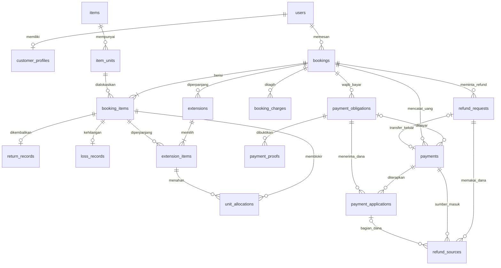

# PRD iRent Semarang

| Atribut | Nilai |
|---|---|
| Produk | Website penyewaan iPhone dan aksesori iRent Semarang |
| Versi | 2.4 — phase 1 PWA; WhatsApp ditunda |
| Tanggal | 9 Oktober 2026 |
| Penyusun awal | Fatih |
| Status | Requirement produk; aplikasi belum diimplementasikan |

Dokumen ini menjadi sumber utama requirement repository. Isinya menggabungkan PRD Development versi 1.0 (4 Oktober 2026, mengacu PRD klien versi 1.4) dengan keputusan percakapan. Aturan terbaru menggantikan aturan awal yang bersesuaian. Keputusan yang masih terbuka tercantum di bagian 19 dan harus diselesaikan sebelum implementasi perilaku terkait.

## 1. Tujuan produk

1. Memudahkan pelanggan melihat ketersediaan, harga, membuat booking, membayar, dan mengunggah bukti sendiri.
2. Menjaga ketepatan stok dan transaksi: tidak ada double booking; pembayaran, tagihan, dan refund dapat ditelusuri.
3. Menjadi satu sumber catatan operasional admin untuk jadwal, pembayaran, pengambilan, pengembalian, dan kondisi unit.

Pelanggan membuat booking tanpa persetujuan admin terlebih dahulu. Sistem memvalidasi aturan dan langsung menahan unit ketika booking berhasil dibuat. Persetujuan admin dilakukan setelah pelanggan mengunggah bukti dan admin memastikan uang masuk.

## 2. Ruang lingkup phase 1

### Dikerjakan

- Website pelanggan: registrasi, login, profil, katalog, booking, upload bukti, riwayat, pengajuan refund, pengajuan perpanjangan per unit, dan laporan pengembalian per unit.
- Panel admin: booking, jadwal, item dan unit, data penyewa, pembayaran, serah terima, pengembalian, persiapan, perawatan, denda, refund, perpanjangan, zona ongkir, pengaturan, dan laporan Excel.
- PWA admin dengan Web Push untuk pengingat admin; WhatsApp ditunda dari phase 1 (keputusan 9 Oktober 2026).
- Deployment ke hosting klien, panduan admin, demo, dan serah terima.

### Di luar phase 1

Payment gateway, panggilan WhatsApp otomatis, notifikasi email, aplikasi native, booking admin untuk pelanggan tanpa akun, ulasan pelanggan, ongkir per kilometer, dan banyak cabang. Antrean tunggu otomatis belum menjadi requirement; FCFS berlaku pada alokasi yang berhasil.

### Batasan utama

- Pembayaran awal melalui QRIS toko dan upload bukti; admin memeriksa transaksi secara manual.
- DP Rp20.000 per booking, tidak dikali hari atau jumlah item. Jika total booking Rp20.000 atau kurang, wajib bayar lunas sebesar total, tanpa pilihan DP.
- Sewa awal 6, 12, 24 jam, atau kelipatan 24 jam, maksimal tujuh hari. Semua paket berlaku setiap hari dengan tarif yang sama untuk weekday dan weekend.
- Satu pelanggan maksimal satu iPhone pada waktu yang bertabrakan. Aksesori boleh lebih dari satu, termasuk sewa tanpa iPhone.
- Jeda satu jam antar penggunaan unit; persetujuan pengembalian dan persiapan fisik tetap wajib.
- Antar-jemput dengan tarif per zona kecamatan untuk antar dan jemput sekaligus.
- Setiap admin mempunyai akun sendiri dan hak akses yang sama.

## 3. Batasan teknis dan arsitektur

Stack dan pola organisasi kode mengadaptasi `AGENTS.template.md` dari proyek oppo-project-control, sesuai persetujuan 8 Oktober 2026. Acuan ini hanya untuk teknologi dan arsitektur; domain, identitas, role, serta aturan bisnis mengikuti iRent. Provider WhatsApp dan hosting belum dipilih.

### Stack yang dipilih

| Lapisan | Teknologi dan penggunaan |
|---|---|
| Backend | TypeScript, NestJS dengan platform Express; API bisnis menggunakan prefix `/api` |
| Database | PostgreSQL dengan Prisma; schema dan migrasi berada di backend |
| Frontend | React, Vite, React Router; website pelanggan dan panel admin `/admin/` dalam satu aplikasi |
| API dan data server | Axios untuk HTTP client terpusat; TanStack React Query untuk query, mutation, dan invalidasi cache |
| State dan form | Zustand untuk state global yang diperlukan; state lokal melalui React; React Hook Form untuk form |
| UI | Tailwind CSS, shadcn/ui, alias `@/` ke src, serta token tema terpusat |
| Pekerjaan latar belakang | Worker NestJS dan scheduler dengan outbox/antrean persisten PostgreSQL; Redis bukan prasyarat phase 1 |
| Notifikasi | PWA admin, Web Push dengan VAPID, adapter WhatsApp ditunda dari phase 1 |

Versi dependency ditetapkan dari manifest baseline yang diperiksa kompatibilitasnya saat scaffolding, lalu dikunci dalam `package-lock.json` masing-masing aplikasi. Template tidak menetapkan nomor versi. Library PWA, upload, Excel, dan pengujian dipilih sesuai kebutuhan; keberadaan stack belum berarti aplikasi sudah tersedia.

### Struktur dan tanggung jawab kode

```text
backend/
  prisma/schema.prisma
  prisma/migrations/
  src/main.ts
  src/app.module.ts
  src/auth/
  src/prisma/
  src/shared/
  src/modules/<feature>/
    <feature>.module.ts
    <feature>.controller.ts
    <feature>.service.ts
    dto/
    repositories/
frontend/
  src/main.tsx
  src/App.tsx
  src/index.css
  src/components/ui/
  src/services/
  src/stores/
  src/<feature>/pages/
  src/<feature>/components/
  src/<feature>/hooks/
```

Backend dan frontend mempunyai manifest, lockfile, `.env.example`, serta install/build terpisah. Nama fitur mengikuti iRent: users, inventory, bookings, availability, pricing, payments, refunds, extensions, returns, notifications, settings, dan reports. Buat folder pendukung hanya ketika dibutuhkan; pembagian modul dapat disederhanakan tanpa menyebarkan aturan bisnis.

Controller menangani HTTP dan guard, service memiliki aturan serta otorisasi entity, repository menangani query/persistence yang bermakna. PrismaService disediakan melalui dependency injection. Modul kecil boleh memakai Prisma langsung jika repository hanya meneruskan query. DTO memakai class-validator/class-transformer dan ValidationPipe global, termasuk validasi nested input, enum, tanggal, dan batas nilai. Identitas pengguna berasal dari sesi yang diverifikasi backend. Daftar paginasi memakai `{ data, meta }` dengan batas limit dan urutan deterministik.

Autentikasi dikelola iRent dengan akun dan password hash di database sendiri; tidak bergantung pada Auth Server ME atau SSO. Mekanisme sesi, cookie/token, refresh/logout, serta CORS/CSRF ditetapkan saat implementasi auth dan harus konsisten antara frontend/backend. Protected route frontend membantu UX; pemeriksaan hak akses tetap di backend.

Keputusan implementasi auth: sesi PostgreSQL dengan token acak yang hanya disimpan sebagai hash, cookie HttpOnly/SameSite=Lax (Secure dan prefix __Host- di produksi), batas absolut delapan jam tanpa refresh token, serta GET session untuk memulihkan konteks/CSRF setelah reload. Mutasi memakai origin allowlist dan CSRF yang terikat sesi; login/registrasi memvalidasi origin dan menerima JSON. Password baru 12–128 karakter di-hash dengan scrypt. Reset password admin menaikkan auth_version dan mencabut semua sesi pelanggan; service mutasi memeriksa ulang otorisasi di bawah user lock. NIK memakai AES-256-GCM dengan keyring/version dan AAD user ID. Kontrak, perintah admin pertama, serta setup kunci di [backend/AUTH.md](backend/AUTH.md).

React Query menjadi sumber data server; mutation menginvalidasi daftar, detail, stok, jadwal, serta agregasi yang terdampak. Zustand tidak menggandakan seluruh data server. HTTP client berada di `services/`, komponen/hook dikelompokkan per fitur, dan type mengikuti response API aktual. UI menggunakan bahasa Indonesia dan satu arah visual Taste yang sesuai iRent.

### Kemampuan wajib

- Transaksi database dan row lock (`SELECT ... FOR UPDATE` atau setara).
- Scheduler tiap menit serta queue/cron untuk pekerjaan latar belakang.
- Penyimpanan bukti pembayaran dan refund privat di luar folder publik; foto item publik.
- Enkripsi NIK di level aplikasi, hash password, otorisasi server, dan perlindungan upload.
- Web Push dengan VAPID dan ekspor Excel; integrasi WhatsApp ditunda.
- HTTPS dan zona waktu `Asia/Jakarta`. Mengikuti PRD awal, datetime bisnis disimpan dalam WIB dan tidak dikonversi secara diam-diam.

Semua aturan bisnis ditempatkan dalam lapisan service bersama. Halaman pelanggan dan admin memanggil service yang sama. Scheduler juga menggunakan aturan transisi yang sama.

| Modul | Tanggung jawab |
|---|---|
| SettingsService | Pengaturan, cache, dan invalidasi cache |
| PricingService | Perhitungan harga sewa, DP, ongkir, perpanjangan, denda, dan snapshot tarif |
| BookingRulesService | Validasi jadwal, durasi, profil, persetujuan, dan batas satu iPhone |
| AvailabilityService | Alokasi per unit, bentrok, hold tambahan, dan kesiapan fisik |
| BookingService | Pembuatan, status, pembatalan, dan audit booking |
| ExtensionService | Pengajuan perpanjangan, hold, verifikasi, dan perubahan jadwal per unit |
| ReturnService | Laporan pelanggan, penerimaan aktual, verifikasi, persiapan, dan perawatan |
| Payment/Refund service | Tagihan, kewajiban bayar, bukti, uang aktual, rekonsiliasi, refund, dan saldo |
| Notification service | Push, pengingat, deduplikasi, dan pencatatan kegagalan; WhatsApp ditunda |

Nama modul tambahan merupakan rancangan teknis untuk mendukung perilaku yang disepakati; pembagian kelas mengikuti stack. Data awal mencakup admin, settings, zona ongkir, dan contoh item. Sediakan perintah pembuatan admin pertama.

Interface perubahan bisnis harus berupa tindakan utuh, misalnya `createBooking`, `approvePaymentAndBooking`, `requestExtension`, `approveExtension`, `verifyReturn`, dan `recordRefundTransfer`. Pemanggil tidak merangkai sendiri perubahan pembayaran, jadwal, dan stok. Perhitungan harga bersifat deterministik; akses waktu, database, storage, dan provider menjadi dependensi yang dapat diganti saat pengujian. Satu tindakan memiliki satu pemilik transaksi, meski implementasinya memanggil beberapa modul internal.

Hosting harus mendukung Node.js untuk API NestJS, PostgreSQL, scheduler dan worker, HTTPS, penyimpanan privat, serta layanan file statis hasil build React. Asumsi biaya shared hosting PHP/MySQL Rp200.000–Rp500.000 per tahun pada dokumen awal tidak menjadi anggaran stack ini. Tetapkan biaya final setelah hosting dipilih; biaya WhatsApp dihitung terpisah.

## 4. Pengaturan dan snapshot

Nilai aturan dibaca dari settings melalui SettingsService dengan cache dan dapat diubah admin. Nama key berikut adalah rancangan implementasi; nilai awal mengikuti keputusan produk.

| Key | Nilai awal | Kegunaan |
|---|---|---|
| dp_amount | 20000 | DP dan ambang wajib lunas |
| hold_minutes | 120 | Batas pembayaran booking biasa |
| urgent_threshold_minutes | 180 | Ambang booking mendesak, termasuk tepat tiga jam |
| urgent_hold_minutes | 30 | Batas pembayaran booking mendesak |
| min_lead_minutes | 120 | Minimal waktu booking sebelum pengambilan |
| confirm_sla_hours | 24 | Waktu maksimum setelah upload booking biasa |
| urgent_confirm_minutes | 60 | Waktu maksimum setelah upload booking mendesak |
| confirm_before_pickup_minutes | 60 | Konfirmasi paling lambat sebelum pengambilan |
| confirmation_reminder_minutes | 30 | Pengingat sebelum batas konfirmasi |
| pickup_escalation_minutes | 20 | Alert tambahan sebelum pengambilan |
| buffer_minutes | 60 | Jeda kalender dan waktu persiapan |
| late_tolerance_minutes | 60 | Toleransi keterlambatan |
| late_fee_per_hour | 10000 | Tarif denda per jam per unit yang terlambat |
| open_time / close_time | 08:00 / 22:00 | Jam operasional |
| max_duration_hours | 168 | Total maksimal sewa per unit |
| booking_open_day | 25 | Pembukaan booking bulan berikutnya |
| no_show_minutes | 180 | Batas pelanggan tidak datang |
| cancel_refund_cutoff_days | 2 | Batas pembatalan lebih awal |
| cancel_refund_percent | 50 | Refund untuk pembayaran DP |
| cancel_full_refund_percent | 75 | Refund untuk pembayaran penuh |
| extension_min_lead_minutes | 120 | Minimal pengajuan sebelum jadwal kembali |
| extension_hold_minutes | 30 | Batas bayar perpanjangan |
| extension_confirm_minutes | 60 | Batas konfirmasi setelah upload perpanjangan |
| extension_confirm_before_return_minutes | 30 | Batas konfirmasi sebelum jadwal kembali lama |
| qris_image_path | Diisi admin | QRIS toko |

Perubahan settings tidak mengubah kesepakatan transaksi lama. Simpan harga, ongkir, DP, waktu kedaluwarsa, batas konfirmasi, dan aturan relevan sebagai snapshot. Tarif 6/12/24 jam pada saat booking awal disimpan untuk menghitung perpanjangan, termasuk paket yang tidak dipilih pada booking awal. Denda yang sudah dihitung dan refund yang disetujui disimpan agar laporan tidak berubah akibat perubahan tarif.

Snapshot mempunyai versi struktur. Tarif dan aturan yang berlaku untuk perpanjangan suatu sewa berasal dari snapshot booking awal; nominal tambahan ongkir disimpan saat pelanggan menyetujui pengajuannya. Settings memvalidasi tipe, nilai nonnegatif, jam buka < jam tutup, rentang tanggal pembukaan 1–28, persentase 0–100, serta hubungan waktu agar deadline tidak terbentuk sebelum pembuatan permintaan. Nilai 1–28 menjaga tanggal pembukaan tetap ada pada setiap bulan. Perubahan key membatalkan cache; rahasia provider/VAPID tetap di environment.

Implementasi settings/katalog/pricing memakai counter revisi settings dan shared/exclusive lock untuk menjaga cache lintas instance. API quote mengembalikan snapshot versi 1 tanpa membuat booking atau hold; alokasi wajib menghitung ulang dan menyimpan snapshot di transaksi booking. Ringkasan unit katalog bukan jaminan kalender. Endpoint dan batas implementasi ada di [backend/INVENTORY_PRICING.md](backend/INVENTORY_PRICING.md).

## 5. Model data dan integritas database

Ini blueprint logis untuk diterjemahkan menjadi schema Prisma dan migrasi PostgreSQL. Gunakan UUID untuk primary key entity lokal dan FK bertipe sama; kode booking/unit tetap identifier bisnis terpisah. Model Prisma menggunakan PascalCase, field camelCase, serta mapping tabel/kolom snake_case melalui `@@map`/`@map`. Gunakan timestamps WIB serta integer rupiah BIGINT, bukan floating point. Representasi BigInt pada response JSON harus ditetapkan secara eksplisit dan type frontend diselaraskan; hindari kehilangan presisi. JSON hanya untuk snapshot/config atau payload; relasi yang menentukan stok dan uang memakai kolom/FK yang dapat divalidasi.

### 5.1 Akun, katalog, dan unit fisik

| Entitas | Kolom dan ketentuan utama |
|---|---|
| users | id, name, email nullable unique, phone nullable unique, password_hash, role customer/admin, is_active, timestamps; wajib email atau phone |
| auth_sessions | id, user_id FK, token_hash unique, auth_version, expires_at, created_at; token mentah hanya berada di cookie |
| auth_rate_limits | key hash primary, count, reset_at; counter atomic PostgreSQL untuk login/registrasi |
| customer_profiles | id, user_id unique FK users, full_name/address/phone_active/nik_ciphertext wajib, phone_alt/instagram/email_contact nullable opsional, completed_at |
| items | id, category iphone/accessory, name, photo_path, includes, price_6h/12h/24h integer >=0, is_active, timestamps |
| item_units | id, item_id FK items, code unique, is_active, condition_status layak/maintenance/lost, physical_status ready/in_use/awaiting_check/in_transit/preparing/lost, preparation_until nullable, maintenance_completed_at nullable, notes, timestamps |
| delivery_zones | id, name kecamatan, fee integer >=0 untuk antar-jemput sekaligus, is_active, timestamps |

Normalisasi email dan nomor HP sebelum pengecekan unique; nomor login dan nomor aktif profil berbeda tujuan. Users menyimpan auth_version nonnegatif untuk invalidasi sesi. Nama lengkap, alamat, nomor HP aktif, dan NIK wajib. Nomor alternatif, Instagram, dan email kontak opsional; pelanggan tidak diblokir karena field opsional kosong. `completed_at` diisi oleh validasi server, bukan input pelanggan. NIK terenkripsi membutuhkan kolom teks yang menampung ciphertext, bukan kolom numerik.

iPhone dan aksesori mempunyai satu baris per unit fisik, termasuk kode aksesori otomatis seperti PB001. Stok merupakan hitungan unit, bukan counter lain yang dapat berbeda. Pengurangan stok hanya menonaktifkan unit bebas tanpa alokasi mendatang; unit terpakai/terpesan/perawatan tidak dihapus. Foto dan profil dapat berubah, tetapi nama/kode serta harga pada transaksi disnapshot untuk menjaga riwayat.

`ready` berarti kondisi fisik siap, bukan bebas untuk semua tanggal. Status fisik tidak dipakai sebagai satu-satunya syarat pencarian kalender; unit in_use yang belum terlambat dapat dipesan untuk tanggal lain. Serah terima membutuhkan `ready`, kondisi layak, aktif, dan jadwal yang sah. Selama perawatan, persiapan, transit, atau pemeriksaan, unit tidak dapat diserahkan.

### 5.2 Booking, jadwal, dan perpanjangan

| Entitas | Kolom dan ketentuan utama |
|---|---|
| bookings | id, code unique, user_id FK users, status, initial_start_at/end_at, delivery_type pickup/delivery, delivery_zone_id nullable FK, delivery_zone_name_snapshot/address/fee_snapshot, initial_rental_total, initial_grand_total, dp_snapshot, pay_option dp/full, amount_due_now, created_at, expires_at, uploaded_at nullable, confirmation_due_at nullable, confirmed_by/at nullable, no_show_due_at, delivery_ready_at/customer_failure_confirmed_at nullable, delivery_failure_reason nullable, shop_delay_seconds, rejected_reason/cancel_reason nullable, terms_version, agreed_terms_at, rules_snapshot, timestamps |
| booking_items | id, booking_id FK, item_id FK, item_unit_id FK, item_name/unit_code_snapshot, initial_start_at, start_at, initial_end_at, current_end_at, shop_delay_seconds, unit_price_snapshot, tariff_6h/12h/24h_snapshot, use_status allocated/in_use/return_pending/returned/lost_closed, picked_up_at/by nullable, handover_note nullable, version, timestamps |
| unit_allocations | id, booking_item_id FK, item_unit_id FK, extension_item_id nullable FK, allocation_kind rental/extension_hold, state active/released, start_at/end_at, block_start_at/block_end_at, hold_expires_at nullable, released_at/reason nullable, timestamps |
| extensions | id, booking_id FK, status draft_quote/menunggu_pembayaran/menunggu_konfirmasi/disetujui/ditolak/kedaluwarsa/dibatalkan, rental_quote_total, extra_delivery_quote, amount_due, delivery_quote_note, quoted_by/at nullable, delivery_agreed_at nullable, submitted_at nullable, created_at, expires_at nullable hingga submit, uploaded_at/confirmation_due_at nullable, approved_by/at nullable, rejected_reason/cancel_reason nullable, timestamps |
| extension_items | id, extension_id FK, booking_item_id FK, old_end_at, proposed_end_at, expected_item_version, added_hours 6/12/24, unit_price_snapshot, confirmation_due_at nullable, timestamps; unique (extension_id, booking_item_id) |
| return_records | id, booking_item_id unique FK, status pending/verified/rejected, reported_at nullable, received_by_courier_at nullable, received_at_store nullable, verified_at/by nullable, fee_return_at nullable, condition_note, damage_amount/note, late_seconds/fee, admin_delay_exemption_seconds, courier_delay_exemption_seconds, exemption_reason, preparation_started_at nullable, timestamps |
| loss_records | id, booking_item_id unique FK, lost_at >= picked_up_at dan <= waktu server, verified_by/at, loss_note, compensation_amount, late_fee, policy_snapshot, timestamps; terpisah dari pengembalian fisik |

`initial_*` tetap untuk riwayat; `booking_items.start_at/current_end_at` adalah jadwal sah terbaru per unit. Pergeseran akibat keterlambatan toko menyimpan durasi keterlambatan dan memperbarui start/end serta alokasi secara atomik; harga dan durasi sewa tidak ditambah hanya karena kompensasi waktu toko. Interval blok yang dipakai mesin stok hanya pada `unit_allocations`; kolom jadwal lain adalah input/ringkasan yang diperbarui atomik, bukan sumber pengecekan kedua. Satu alokasi rental aktif per booking_item; hold tambahan menunjuk extension_item sehingga dapat dilepas tanpa menghapus sewa awal. Saat ganti unit, alokasi lama dilepas, alokasi baru dibuat, referensi saat ini diperbarui, dan jejak unit lama tetap tersimpan.

`return_records` membedakan laporan pelanggan, penyerahan ke petugas, penerimaan di toko, verifikasi, waktu untuk denda, serta pengecualian keterlambatan. Admin dapat mencatat pengembalian langsung tanpa menunggu pelanggan menekan tombol. Satu pengembalian final terverifikasi per booking_item; koreksi waktu/kondisi diaudit, mengoreksi tagihan melalui adjustment, bukan memverifikasi ulang dan menggandakan denda.

### 5.3 Tagihan, bukti, uang aktual, dan refund

| Entitas | Kolom dan ketentuan utama |
|---|---|
| booking_charges | id, booking_id FK, booking_item_id nullable FK, extension_id nullable FK, kind rental/delivery/extension/extra_delivery/late/damage/loss/adjustment, direction debit/credit, amount integer >=0, related_charge_id nullable FK, effective_at, reason, created_by nullable, source_key unique, timestamps |
| payment_obligations | id, booking_id FK, extension_id nullable FK, purpose initial_dp/initial_full/settlement/extension, amount_due, expires_at nullable, status open/proof_pending/satisfied/closed, pending_proof_id nullable FK, created_at |
| payment_proofs | id, payment_obligation_id FK, proof_path privat, mime, size, file_hash, claimed_amount, uploaded_at, status pending/verified/rejected, reviewed_by/at nullable, rejected_reason nullable |
| payments | id, booking_id FK, payment_obligation_id nullable FK, extension_id nullable FK, proof_id nullable FK, refund_request_id nullable unique FK, direction in/out, type dp/full/settlement/extension/refund/reconciliation, method qris/cash/transfer, amount >0, occurred_at, recorded_at, recorded_by FK, receiving_account_reference/transaction_reference nullable, attachment_path nullable privat, source_key unique, note |
| payment_applications | id, incoming_payment_id FK payments, payment_obligation_id FK, amount >0, state reserved/applied/released, created_at; unique (incoming_payment_id, payment_obligation_id) |
| refund_requests | id, booking_id FK, extension_id nullable FK, status diajukan/disetujui/ditolak/sudah_dikembalikan, reason_code/note, requested_amount, approved_amount nullable, policy_snapshot, approved_by/at nullable, rejected_reason nullable, recipient_details privat, transferred_at nullable, created_at |
| refund_sources | id, refund_request_id FK, incoming_payment_id FK payments, payment_application_id nullable FK, amount >0; sumber terkait penerapan atau dana tidak diterapkan, dengan unique per request/payment/bagian sumber |

Bukti merupakan klaim yang dapat pending/ditolak. `payments` hanya berisi uang aktual yang telah dipastikan admin; tidak ada receipt pending yang sudah ikut saldo. Bukti ditolak tetap dapat mempunyai receipt rekonsiliasi jika uang ternyata masuk. Satu bukti tidak menghasilkan dua receipt atas transaksi yang sama. Pembayaran tunai admin dapat dicatat tanpa bukti pelanggan.

Kewajiban bayar awal dan setiap perpanjangan terpisah. Satu `pending_proof_id` per kewajiban membatasi bukti pending; upload/review mengunci baris kewajiban dan bukti. Pembayaran sah memenuhi kewajiban dan, bila relevan, menyetujui booking/perpanjangan dalam transaksi yang sama. Jumlah kewajiban bukan total tagihan: DP adalah cara membayar sebagian tagihan sewa, bukan charge tambahan.

Receipt menyimpan seluruh uang nyata, sedangkan payment_applications menyimpan bagian yang digunakan untuk kewajiban tertentu. Jumlah penerapan aktif tidak melebihi receipt; dana perpanjangan sebelum approval berstatus reserved, bukan applied ke sewa awal. Dana melebihi kewajiban tidak diterapkan sebagai cicilan diam-diam: selisih menjadi kelebihan yang wajib dikembalikan penuh. Refund atas kelebihan tidak mengurangi pembayaran yang sudah memenuhi kewajiban. Saat approval/rejection/refund, receipt, aplikasi dana, dan source refund dikunci bersama.

Tagihan awal dibuat sekali. Charge perpanjangan/ongkir tambahannya hanya berlaku ketika perpanjangan disetujui; quotation pending disimpan di extensions dan bukan tagihan sah. Denda/kerusakan dibuat saat pengembalian diverifikasi. Koreksi dan penghapusan kewajiban sewa akibat pembatalan memakai charge credit dengan alasan/audit; riwayat charge/receipt sah tidak ditimpa atau dihapus.

Refund mengacu ke receipt masuk melalui refund_sources, termasuk jika dana berasal dari beberapa pembayaran. Saat persetujuan, kunci receipt dan cadangkan nominal agar dua refund tidak memakai uang yang sama. Jumlah refund disetujui belum ditransfer ditambah refund selesai atas satu receipt tidak boleh melebihi receipt tersebut. Menandai sudah dikembalikan membuat satu payment keluar, bukti transfer, dan status akhir secara atomik. Booking/refund_sources/payment keluar wajib konsisten kepemilikannya. Transfer parsial belum ditentukan sebagai fitur; satu pencatatan selesai harus sesuai nominal yang disetujui.

Validasi kapasitas refund dilakukan per receipt dan bagian dana: refund berhubungan dengan payment_application hanya menggunakan dana bagian tersebut; refund kelebihan menggunakan sisa yang tidak diterapkan. Cegah kelebihan yang sama masuk lagi dalam dasar refund pembatalan. Foreign key ke payment_applications wajib sesuai incoming_payment_id dan booking yang sama.

### 5.4 Log, pekerjaan latar belakang, dan request berulang

| Entitas | Kolom dan ketentuan utama |
|---|---|
| booking_status_logs | id, booking_id FK, from_status nullable/to_status, actor_id nullable FK users, note, created_at |
| audit_logs | id, actor_id nullable, action, entity_type/id, perubahan relevan yang telah disaring, reason, correlation_id, created_at |
| settings | id atau key primary, key unique, typed_value, updated_by nullable, timestamps |
| push_subscriptions | id, user_id FK, endpoint unique, p256dh, auth, user_agent, timestamps |
| idempotency_requests | id, actor_id FK, operation, key, request_hash, status/result_reference, timestamps; unique (actor_id, operation, key) |
| outbox_events | id, event_key unique, aggregate_type/id, event_type, payload tanpa data sensitif, occurred_at, dispatched_at nullable, attempts, error |
| notification_deliveries | id, outbox_event_id nullable FK, source_type/id, event_type, recipient_admin_id FK, channel, due_at, status queued/sending/sent/failed/skipped, attempts, retry_at/provider_reference/error nullable, deduplication_key unique, timestamps |

Outbox disimpan bersama transaksi bisnis sehingga crash setelah commit tidak menghilangkan notifikasi. Worker memproses ulang dengan idempotency; jangan mengklaim exactly-once pada jaringan provider. Jika provider menerima pesan tetapi respons hilang, deduplikasi provider dipakai jika tersedia dan hasil pengiriman ambigu dicatat.

### 5.5 Foreign key, constraint, dan indeks

- Seluruh `*_by`, `user_id`, dan referensi transaksi adalah FK ke entitas yang sesuai; actor sistem boleh null. Relasi transaksi memakai RESTRICT atau penonaktifan, bukan cascade delete yang menghapus riwayat uang/stok.
- Enum/status harus dibatasi. CHECK/validasi transaksi memastikan akhir > awal, durasi valid, nominal dan persentase valid, serta field bersyarat: delivery wajib zona/alamat; refund selesai wajib transfer/receipt keluar; pembayaran terverifikasi wajib aktor/waktu.
- Cross-table invariant: item_unit sesuai item pada booking_item; extension_item milik booking pada extensions; payment/proof/refund dan seluruh source receipt berasal dari booking yang sama. FK sederhana tidak cukup untuk semua aturan ini; tambahkan composite FK/constraint jika didukung dan validasi service dalam transaksi.
- Payment_application hanya menunjuk payment masuk dan kewajiban dari booking/scope yang sama. Jumlah penerapan awal tidak melebihi receipt; refund bagian penerapan dibatasi bagian tersebut, sedangkan refund dana tidak diterapkan dibatasi sisa receipt. Jangan menjumlahkan aplikasi dan refund atas dana yang sama seolah-olah dua penggunaan berbeda. Loss_record hanya untuk unit yang sedang disewa, tidak boleh bersamaan dengan pengembalian final verified. Nominal dan waktu kehilangan wajib diverifikasi admin.
- Unique: user email/phone ternormalisasi, unit code, booking code, extension-item pair, return per booking_item, source_key charge/payment, refund payment reference, idempotency key, endpoint, serta notification deduplication key.
- Satu unit fisik tidak boleh muncul dua kali dalam satu booking awal: unique (booking_id, item_unit_id) pada booking_items. Jumlah aksesori di UI diuraikan menjadi baris per unit; tidak ada quantity >1 yang hanya menunjuk satu item_unit.
- Referensi transaksi bank/QRIS yang tersedia harus unik dalam rekening/akun sumber yang sesuai. Referensi tidak boleh dibuat-buat untuk menggantikan pencocokan uang aktual; pembayaran tunai menggunakan nomor penerimaan aplikasi. Receipt sah tidak diedit atau dihapus melalui CRUD umum. Mekanisme koreksi kesalahan pencatatan harus diaudit dan mempertahankan riwayat; prosedur koreksi receipt masuk mengikuti ketentuan di bawah.
- Maksimal satu pengajuan perpanjangan nonterminal per booking_item. Gunakan constraint aktif jika engine mendukung atau satu referensi aktif yang dikunci; jangan hanya mengecek lewat UI. Maksimal satu alokasi rental aktif per booking_item, tanpa menghapus sejarah released.
- Unique index tidak mencegah interval waktu bertabrakan. Pemeriksaan overlap tetap wajib di dalam protokol locking yang sama pada seluruh jalur tulis.
- Indeks pencarian: bookings `(status, initial_start_at)`, `(user_id, status)`, expires_at, confirmation_due_at, no_show_due_at; booking_items `(booking_id, use_status)`, `(item_unit_id, current_end_at)`; unit_allocations `(item_unit_id, state, block_start_at)`, hold_expires_at; extension status/expiry/deadline; item_units `(item_id, is_active, condition_status)`; charges/payments `(booking_id, extension_id, effective_at/occurred_at)`; refunds `(booking_id, status)` dan incoming_payment_id; outbox dispatch state; notifications `(status, retry_at, due_at)`.
- Generate kode booking dan kode aksesori secara atomik melalui sequence/counter terkunci atau ID yang unique. Hindari pola membaca MAX kemudian menambah satu tanpa kunci. Jika contoh kode IRN261010001 dipakai, format dan overflow tetap diperiksa.

Constraint kondisional dan indeks rentang diterapkan melalui migrasi PostgreSQL yang ditinjau; gunakan SQL migrasi eksplisit bila tidak dapat direpresentasikan oleh schema Prisma. Row lock yang diperlukan menggunakan query berparameter dalam transaksi Prisma dengan urutan lock yang konsisten; ORM tidak menggantikan perlindungan konkurensi. Uji migration/constraint, isolation, dan rencana query pada PostgreSQL; blueprint ini belum merupakan DDL siap dijalankan. Gunakan `prisma migrate dev` untuk membuat migrasi development dan `prisma migrate deploy` saat deployment, serta generate Prisma Client setelah schema berubah. Riwayat transaksi dilindungi dari cascade delete; lifecycle file ditangani terpisah.

### 5.6 Diagram relasi inti



Diagram menunjukkan relasi utama; refund Sources menunjuk payment masuk, sedangkan relasi transfer keluar menunjuk payment berbeda. Arah uang wajib divalidasi, bukan ditentukan hanya oleh adanya FK.

## 6. Booking awal dan perhitungan harga

### 6.1 Validasi

Semua validasi server diperiksa ulang dalam transaksi alokasi:

1. Minimal satu item. Maksimal satu unit iPhone; aksesori dibatasi stok.
2. Durasi awal 6/12 jam atau kelipatan 24 jam hingga 168 jam.
3. Semua paket sewa awal tersedia setiap hari, termasuk Sabtu dan Minggu. Tidak ada pembatasan atau perbedaan tarif berdasarkan weekday/weekend; perpanjangan mengikuti aturan yang sama.
4. Pengambilan dan pengembalian dalam 08.00–22.00. Pilihan jam yang melanggar disembunyikan dan tetap divalidasi server. Sewa 12 jam paling lambat mulai 10.00.
5. Pengambilan minimal dua jam dari saat booking dibuat.
6. Sebelum tanggal 25, tanggal pengambilan paling jauh akhir bulan berjalan; mulai tanggal 25, sampai akhir bulan berikutnya. Tidak memakai batas bergulir 30 hari.
7. Pelanggan tidak mempunyai sewa iPhone lain yang bertabrakan dengan interval penggunaan, termasuk tambahan yang sedang dialokasikan untuk perpanjangan.
8. Antar-jemput membutuhkan zona aktif dan alamat; boleh berbeda dari alamat profil.
9. Profil lengkap dan seluruh persetujuan wajib dicentang.

Sewa iPhone yang telah lewat jadwal tetapi pengembaliannya belum diverifikasi tetap dihitung sebagai iPhone yang belum kembali. Pelanggan tidak dapat mengambil iPhone lain untuk menyiasati batas satu unit dengan memakai jadwal lama yang sudah berakhir. Periksa ulang kondisi ini saat alokasi dan serah terima; pengembalian pending belum membebaskan kewajiban tersebut.

### 6.2 Harga

```text
harga_item = price_6h untuk 6 jam
             price_12h untuk 12 jam
             k * price_24h untuk 24k jam
rental_total = jumlah harga semua unit
grand_total_awal = rental_total + delivery_fee
jika grand_total_awal <= dp_amount:
    pay_option = full
    amount_due_now = grand_total_awal
selain itu:
    amount_due_now = dp_amount jika memilih DP, atau grand_total_awal jika lunas
```

DP flat tidak dikali jumlah unit atau hari. Sewa aksesori saja diperbolehkan dan mengikuti aturan harga yang sama. Harga, ongkir, dan nominal wajib dibayar ditampilkan sebelum pelanggan menyetujui booking.

### 6.3 Batas pembayaran dan konfirmasi

| Kategori saat booking dibuat | Batas upload | Batas konfirmasi setelah upload |
|---|---|---|
| Mendesak: dua sampai tiga jam sebelum pengambilan, termasuk tepat tiga jam | 30 menit sejak dibuat | Lebih awal antara upload + satu jam dan pengambilan − satu jam |
| Biasa: lebih dari tiga jam sebelum pengambilan | Dua jam sejak dibuat | Lebih awal antara upload + 24 jam dan pengambilan − satu jam |

Pelanggan dapat langsung membayar dan upload setelah booking dibuat. Tidak menunggu izin admin. Kategori dan deadline dihitung di server dan disimpan; countdown hanya tampilan.

Tanpa upload sampai deadline, booking kedaluwarsa. Setelah upload tepat waktu, batas pembayaran tidak melepas unit; booking tetap menahan alokasi sampai diputuskan. Admin terlambat konfirmasi memicu label dan alert, bukan persetujuan/penolakan otomatis. Serah terima tetap memerlukan konfirmasi dan pelunasan.

Gunakan waktu server setelah permintaan memperoleh kunci. Minimal dua jam dan batas pengajuan perpanjangan tepat dua jam bersifat inklusif. Upload paling lambat `expires_at` dapat diterima jika penyimpanan file dan pencatatan bukti berhasil pada waktu itu; expiry hanya jika `now > expires_at`. Upload setelah deadline ditolak walaupun scheduler belum jalan. Memulai upload sebelum deadline tidak menjamin diterima jika baru selesai setelahnya. Tidak ada reset countdown hanya karena refresh atau upload ulang.

### 6.4 Tagihan, saldo, dan laporan kas

Sumber tagihan adalah booking_charges, sumber uang aktual adalah payments. Field total yang disimpan pada booking merupakan snapshot/ringkasan yang dapat direkonsiliasi, bukan saldo yang bebas diedit admin.

```text
tagihan_sah(scope) = jumlah charge debit - jumlah charge credit
dana_bersih(scope) = uang masuk terkonfirmasi - refund keluar yang telah dicatat
sisa_tagihan(scope) = max(0, tagihan_sah(scope) - dana_yang_diterapkan_ke_scope)
kelebihan_dana(scope) = dana aktual tidak diterapkan + kelebihan setelah penyesuaian charge
kas_bersih(periode) = seluruh payment in pada occurred_at periode
                      - seluruh payment out pada occurred_at periode
```

Scope membedakan sewa awal/settlement dan setiap perpanjangan. Dana tambahan yang sudah terkonfirmasi tetapi perpanjangannya belum berlaku tidak boleh melunasi sewa awal, denda, atau perpanjangan lain. Dana tersebut tetap muncul sebagai kas masuk dan dana menunggu keputusan. Saat pengajuan disetujui, charge tambahannya diterbitkan dan dana diterapkan ke scope itu; saat ditolak, dana menjadi kewajiban refund tanpa mengurangi tagihan sewa awal. Refund keluar mengikuti scope receipt sumbernya.

Dana yang diterapkan ke scope berasal dari payment_applications berstatus applied, dikurangi refund selesai atas bagian aplikasi tersebut. Gross receipt yang belum diterapkan atau merupakan kelebihan tidak membuat label lunas. Seluruh gross receipt tetap tercatat dalam laporan kas.

Untuk menghitung sisa dana tidak diterapkan setelah refund: mulai dari receipt dikurangi seluruh refund selesai dari receipt itu, lalu kurangi penerapan/reservasi aktif setelah refund atas bagian masing-masing. Refund yang belum ditransfer masih menjadi kewajiban terpisah. Jangan terus menampilkan kelebihan Rp5.000 sesudah refund Rp5.000 benar-benar selesai, atau menghitung refund linked dan unused dua kali.

Pembatalan menutup kewajiban sewa yang tidak jadi berlangsung melalui adjustment charge; jumlah yang ditahan mengikuti kebijakan pembatalan. Pelanggan tidak ditagih seluruh sisa sewa yang sudah dibatalkan. Refund yang disetujui belum keluar tampil sebagai kewajiban pengembalian, bukan pengurang kas. Saldo refund, piutang, dan dana menunggu keputusan tampil terpisah.

Contoh: sewa Rp100.000 dibayar DP Rp20.000, lalu batal lebih awal dengan refund 50% DP. Tagihan setelah penyesuaian Rp10.000, kewajiban refund Rp10.000; tidak ada piutang sisa sewa Rp80.000. Sebelum transfer, kas masuk tetap Rp20.000; setelah refund tercatat, kas bersih Rp10.000.

Contoh lain: sewa awal Rp100.000 sudah lunas dan dana perpanjangan Rp50.000 masuk. Jika perpanjangan ditolak, refund Rp50.000 tidak membuat sewa awal kurang bayar; scope sewa awal tetap lunas. Laporan kas bersih setelah refund Rp100.000.

Laporan yang disebut pendapatan pada UI mengikuti definisi kas bersih PRD, bukan pengakuan pendapatan akrual. Setiap payment memakai waktu transaksi aktual dan waktu pencatatan terpisah. Koreksi backdate harus beralasan dan diaudit karena dapat mengubah laporan periode sebelumnya. Persentase refund dibulatkan ke rupiah terdekat dengan half-up satu kali pada total eligible; simpan dasar dan hasil, jangan membulatkan per baris lalu menjumlahkan hasil yang berbeda.

## 7. Ketersediaan, buffer, dan FCFS

### Kalender dan kesiapan fisik

Bentrok diperiksa menggunakan interval sewa baru terhadap interval blok alokasi yang sudah ada, dengan batas terbuka: `existing.block_start < requested.end` dan `existing.block_end > requested.start`. Interval blok menambahkan satu jam sebelum dan sesudah sewa. Jarak tepat satu jam antara akhir dan awal penggunaan diperbolehkan; jangan membandingkan dua interval blok sehingga tanpa sengaja mewajibkan dua jam.

Sumber konflik mencakup booking menunggu bayar yang belum kedaluwarsa, menunggu verifikasi, dikonfirmasi, sewa berjalan, pengembalian yang belum diverifikasi, serta hold/perpanjangan terkonfirmasi. Pemeriksaan perpanjangan mengabaikan alokasinya sendiri, tetapi tetap memperhitungkan alokasi lain.

Perpanjangan memeriksa jendela penggunaan penuh unit dari awal sewa sampai proposed_end_at terhadap alokasi pelanggan lain. Alokasi rental milik booking_item tersebut boleh diabaikan karena digantikan/diperluas, tetapi hold lain tetap dilindungi. Maksimal satu pengajuan nonterminal per booking_item. Saat approve, old_end_at dan expected_item_version harus masih cocok; alokasi rental diperluas dan hold tambahan dilepas dalam transaksi yang sama. Riwayat extension_items dipertahankan. Hindari menghitung rental dan perpanjangan yang sudah disetujui sebagai dua blok terpisah yang menabrak satu sama lain.

- Hold belum dibayar yang kedaluwarsa dianggap bebas walaupun scheduler belum memperbarui status.
- Unit yang belum kembali tidak menjadi ready hanya karena jadwal berakhir atau pelanggan menekan tombol laporan pengembalian.
- Unit terlambat tetap tertahan sampai admin memverifikasi pengembalian, lalu persiapan selesai.
- Ketika pengembalian telah diverifikasi tetapi persiapan belum selesai, booking baru dengan waktu mulai sebelum preparation_until ditolak. Booking masa depan setelah preparation_until tetap diperiksa terhadap seluruh alokasi lain.
- Unit perawatan/inactive tidak tersedia. Unit yang sedang dipakai pada jadwal lain masih dapat memiliki booking masa depan jika tidak bentrok dan tidak sedang terlambat.
- Persetujuan pengembalian tidak menghapus booking masa depan. Kesiapan aktual dan kalender harus sama-sama dipenuhi saat serah terima.
- Pelepasan alokasi kalender saat verifikasi pengembalian tidak sama dengan physical_status ready. Waktu persiapan aktual tetap memblokir pengambilan yang terlalu cepat; berakhirnya persiapan tidak menghapus alokasi pelanggan lain.
- Pergantian ke perawatan atau preparation_until yang melewati jadwal pengambilan booking berikutnya juga memicu label berisiko dan penanganan admin, bukan hanya keterlambatan sewa. Tidak boleh diam-diam menghapus alokasi pelanggan yang sudah ada.

### Transaksi dan fairness

FCFS berarti permintaan valid yang lebih dahulu berhasil memperoleh alokasi di server mendapat unit. Waktu klik perangkat pelanggan tidak menjadi patokan. Row lock tidak boleh diklaim menjamin urutan kedatangan HTTP secara mutlak.

```text
mulai transaksi
  periksa identitas permintaan untuk mencegah duplikasi
  kunci pelanggan, item/unit, dan transaksi terkait dalam urutan konsisten
  validasi ulang aturan, waktu, pembayaran yang relevan, dan harga
  periksa alokasi booking serta hold perpanjangan
  pilih unit kosong pertama dengan urutan stabil
  simpan booking/pengajuan, alokasi, snapshot, audit, dan outbox event
commit
  worker mengambil outbox dan mengirim notifikasi setelah commit
```

Kunci pelanggan atau mekanisme setara diperlukan agar dua permintaan iPhone dari pelanggan sama pada item berbeda tidak melewati batas satu iPhone. Gunakan idempotency untuk klik ganda/retry. Ganti unit, persetujuan perpanjangan, pembatalan, expiry, dan upload di dekat deadline memakai aturan transaksi konsisten. Permintaan untuk unit terakhir yang kalah menerima pesan “Item sudah dipesan pada waktu itu”.

Protokol lock mempunyai urutan global untuk seluruh action, bukan hanya mengurutkan ID dalam satu endpoint. Validasi stok setelah lock harus membaca data terbaru yang sudah commit, bukan snapshot yang dibentuk sebelum menunggu lock. Pilih isolation/locking read sesuai engine dan uji perilaku ini. Semua perubahan stok/perawatan juga memegang kunci item/unit yang sama. Deadlock/lock timeout menggunakan retry terbatas tanpa menggandakan hasil; respons gagal tidak meninggalkan alokasi sebagian.

Key idempotency disimpan dengan hash payload dan referensi hasil. Payload sama dengan key sama mengembalikan hasil sebelumnya; payload berbeda dengan key sama ditolak. Dua admin approve/refund/return bersamaan hanya menghasilkan satu perubahan. Sumber biaya denda dan refund payment mempunyai unique source_key agar retry job/tombol tidak membuat uang atau tagihan ganda.

Riwayat FCFS adalah tampilan urutan alokasi booking yang tercatat, termasuk ditolak/kedaluwarsa, bukan antrean yang otomatis memenangkan permintaan gagal. Admin tidak dapat memperpanjang atau mengganti unit dengan menabrak hak alokasi pelanggan lain.

## 8. Status dan alur pembayaran

Gunakan kode status internal yang konsisten dengan PRD awal, dengan label UI yang jelas:

| Kode | Label pelanggan | Makna |
|---|---|---|
| menunggu_pembayaran | Dipesan — menunggu pembayaran | Alokasi berhasil, belum upload |
| menunggu_konfirmasi | Menunggu verifikasi pembayaran | Bukti masuk, belum diverifikasi |
| dikonfirmasi | Booking dikonfirmasi | Pembayaran awal diverifikasi dan booking disetujui |
| berjalan | Sedang disewa | Barang telah diserahkan; dapat mencakup pengembalian sebagian |
| selesai | Selesai | Semua unit sudah diverifikasi kembali atau sewanya ditutup karena hilang; tagihan dapat masih tersisa |
| kedaluwarsa | Kedaluwarsa | Lewat batas upload tanpa bukti yang diterima |
| ditolak | Ditolak | Admin menolak dengan alasan |
| dibatalkan | Dibatalkan | Pembatalan pelanggan/admin/no-show |

Laporan pengembalian memiliki status **menunggu verifikasi pengembalian** per unit; tampilkan sebagai label/progres pada booking terkait. Barang yang belum diverifikasi tetap terpakai. Booking selesai saat seluruh unit berstatus returned atau lost_closed; label kehilangan tetap terlihat agar penutupan sewa tidak disalahartikan sebagai pengembalian fisik. Kesiapan persiapan/perawatan tetap dicatat terpisah.

```text
menunggu_pembayaran --upload--> menunggu_konfirmasi
menunggu_konfirmasi --verifikasi pembayaran & setujui--> dikonfirmasi
dikonfirmasi --pelunasan & serah terima--> berjalan
berjalan --semua unit returned atau lost_closed--> selesai
menunggu_pembayaran --expiry--> kedaluwarsa
menunggu_konfirmasi --tolak booking--> ditolak
menunggu_pembayaran/menunggu_konfirmasi/dikonfirmasi --batal--> dibatalkan
```

Setiap transisi melalui service dan menulis log aktor/waktu/alasan. Terlambat kembali, terlambat konfirmasi, dan booking berisiko adalah label perhitungan, bukan otomatis menjadi status terminal.

### Bukti dan tindakan admin

- Bukti berupa JPG/PNG/PDF maksimal 2 MB, nama acak, disimpan privat.
- Akses bukti hanya pemilik booking atau admin melalui route berotorisasi.
- Beberapa bukti historis diperbolehkan, tetapi satu pending untuk satu kewajiban pembayaran pada satu waktu. Booking awal dan perpanjangan mempunyai kewajiban terpisah.
- Pemeriksaan bukti menggunakan status bukti, sementara dana terkonfirmasi dicatat di payments. Receipt rekonsiliasi tidak mengubah bukti yang ditolak menjadi sah secara diam-diam. Bukti yang sama, nominal sama, atau hash file sama belum cukup membuktikan transaksi bank berbeda; admin memeriksa referensi transaksi agar satu uang masuk tidak dicatat dua kali.
- Upload belum berarti paid/lunas. Status pembayaran dibedakan dari status booking: belum terverifikasi, DP terverifikasi, atau lunas menurut pembayaran sah dan tagihan.
- Admin memeriksa nominal serta transaksi masuk. Tindakan “Verifikasi pembayaran & setujui booking” mengubah pembayaran dan booking dalam satu transaksi.
- Persetujuan memerlukan dana sah pada kewajiban terkait sekurangnya amount_due; nominal pada screenshot tidak menjadi dasar saldo. Jika dana nyata sudah dipastikan tetapi persetujuan bisnis gagal, dana tersebut tetap harus dicatat sebagai receipt rekonsiliasi dengan keputusan gagal/refund yang sesuai, bukan hilang karena rollback action approval. Penyimpanan receipt dan keputusan akhirnya harus konsisten.
- Menolak bukti berbeda dari menolak booking. Bukti ditolak kembali ke menunggu pembayaran jika deadline asli belum lewat; jika sudah lewat, booking kedaluwarsa. Alasan wajib.
- Jika booking kedaluwarsa atau bukti ditolak tetapi uang ternyata sudah masuk, admin merekonsiliasi dan mencatat dana yang benar-benar diterima, lalu memproses refund penuh melalui alur manual. Booking tidak diaktifkan ulang otomatis dan alokasi pelanggan lain tetap dilindungi.

### Pembayaran kurang, lebih, dan pelunasan bertahap

- Admin mencatat nominal aktual, tidak menyesuaikannya agar seolah-olah sama dengan nominal diminta.
- Kurang bayar tidak membuat kewajiban satisfied atau booking/perpanjangan disetujui. Bagian uang yang masuk ditahan pada kewajiban terkait; tampilkan sisa kekurangan. Pelanggan dapat melengkapi dengan bukti berikutnya, tetap satu bukti pending per kewajiban.
- Untuk pembayaran awal/perpanjangan, kekurangan wajib dibayar dan buktinya diunggah dalam deadline pembayaran asli. Setelah bukti pertama terbukti kurang, upload ulang tidak mendapat countdown baru. Jika deadline sudah lewat tanpa kelengkapan, booking/pengajuan kedaluwarsa, alokasi terkait dilepas, dan dana kewajiban gagal dikembalikan penuh.
- Bukti kelengkapan yang diunggah tepat waktu tetap dapat diperiksa setelah deadline; expiry tidak boleh mengalahkan upload lengkap yang telah diterima. Dana yang belum dipastikan admin tetap bukan saldo sah.
- Pelunasan sebelum serah terima harus memenuhi seluruh sisa tagihan; pembayaran kurang tidak mengizinkan barang diserahkan.
- Lebih bayar: terapkan hanya bagian yang memenuhi kewajiban, lalu refund seluruh selisih secara manual. Kelebihan tidak mengubah pilihan DP menjadi lunas secara otomatis dan tidak dikurangi persentase pembatalan.
- Jika nominal diminta Rp20.000 dan receipt Rp25.000, penerapan DP Rp20.000 dan kelebihan Rp5.000. Refund kelebihan Rp5.000 tidak membuat DP kurang bayar. Saat batal lebih awal, dasar refund DP tetap Rp20.000, bukan Rp25.000.

## 9. Pembatalan, refund, dan no-show

### Kebijakan nominal

| Penyebab | Refund |
|---|---|
| Ditolak admin atau dibatalkan karena kesalahan toko, termasuk unit rusak/tidak ada pengganti | Seluruh pembayaran yang telah diterima untuk booking terdampak |
| Pelanggan batal lebih dari dua hari sebelum pengambilan, baru bayar DP | 50% DP |
| Pelanggan batal lebih dari dua hari sebelum pengambilan, bayar penuh | 75% pembayaran penuh |
| Pelanggan batal tepat dua hari atau kurang sebelum pengambilan | Tidak ada refund |
| Perpanjangan ditolak tetapi uang tambahan sudah diterima | Seluruh biaya perpanjangan; booking awal tetap berlaku |
| Booking kedaluwarsa atau bukti ditolak, tetapi uang ternyata masuk | Seluruh dana terkait yang diterima setelah rekonsiliasi admin; tidak otomatis mengaktifkan booking |
| Kelebihan pembayaran atau dana kewajiban bayar yang gagal dipenuhi | Bagian dana tersebut dikembalikan penuh; terpisah dari persentase pembatalan |
| Tidak datang tiga jam setelah jadwal pengambilan | DP hangus; uang di atas DP dikembalikan |

Booking kecil yang wajib bayar penuh mengikuti kategori pembayaran penuh untuk pembatalan lebih awal. Untuk no-show, refund = `max(0, uang terverifikasi − nominal DP snapshot)` dengan memperhitungkan refund sebelumnya. Total kecil yang tidak melebihi DP tidak mendapat refund no-show.

Kategori DP atau lunas untuk refund ditentukan oleh dana sah yang sudah diterapkan pada tagihan sebelum pembatalan, bukan hanya pilihan awal pay_option atau gross receipt. DP yang kemudian dilunasi melalui kewajiban settlement mengikuti refund pembayaran penuh 75%. Jika baru DP yang memenuhi kewajiban, refund 50% DP. Dana tambahan pada kewajiban pelunasan yang belum terpenuhi dikembalikan penuh sebagai dana belum diterapkan, bukan dikenai potongan baru. Kelebihan pembayaran selalu direfund penuh dan tidak dihitung lagi dalam dasar persentase. Snapshot menyimpan aplikasi dana sumber, nominal eligible, kategori, dan total sah sebelum adjustment pembatalan.

Phase 1 tidak menyediakan pembatalan sebagian oleh pelanggan: action membatalkan seluruh booking sebelum serah terima. Perpanjangan dan pengembalian tetap dapat per unit. Untuk kegagalan operasional toko yang tidak dapat diganti/diselesaikan, tawarkan perubahan jadwal atau pembatalan booking penuh, bukan mengurangi item/harga secara diam-diam.

Batas lebih dari dua hari berarti selisih timestamp WIB lebih dari 48 jam sebelum initial_start_at, bukan sekadar beda tanggal kalender. Kebijakan persentase dan batas waktu memakai snapshot booking. Pembatalan mandiri pada alur ini berlaku sebelum serah terima; penyelesaian sewa yang sudah berjalan menggunakan pengembalian dan tagihan, bukan action batal yang melepas barang belum kembali.

### Proses manual

1. Pelanggan mengajukan refund; admin menyetujui atau menolak dengan alasan. Refund akibat pembatalan operasional/no-show juga dikelola admin.
2. Persetujuan menyimpan nominal yang berhak dikembalikan, tetapi belum berarti uang ditransfer.
3. Admin mengirim uang di luar aplikasi.
4. Admin menandai **sudah dikembalikan**, mencatat nominal, waktu, dan bukti transfer privat.
5. Pencatatan uang keluar dan penyelesaian refund dilakukan konsisten dan tidak dapat digandakan.

Refund tidak melebihi dana diterima setelah refund terdahulu dan cadangan refund lain yang sudah disetujui. Pendapatan hanya berkurang setelah pengembalian uang dicatat selesai, bukan saat permintaan disetujui. Pembatalan booking dan proses refund mempunyai status terpisah agar unit tidak tertahan hanya karena transfer belum dilakukan. Admin wajib memastikan status transfer aktual sebelum mengulangi transfer di luar sistem; idempotency pencatatan aplikasi tidak dapat mencegah dua transfer bank manual.

### Pelanggan tidak datang

Job membatalkan booking dikonfirmasi yang belum serah terima setelah tiga jam dari jadwal pengambilan. Booking yang masih menunggu konfirmasi admin tidak otomatis dianggap pelanggan no-show. Pembatalan no-show melepaskan alokasi yang belum dipakai, mencatat alasan, dan mengikuti refund di atas.

Job mengunci booking dan membaca ulang status sebelum keputusan agar tidak membatalkan serah terima bersamaan. Untuk pickup, kandidat mengikuti no_show_due_at tiga jam dari jadwal sah. Untuk delivery, pembatalan no-show hanya boleh diproses setelah admin mencatat petugas telah siap menyerahkan barang dan gagal karena pelanggan, dengan waktu/alasan. Petugas yang belum mengantar atau keterlambatan toko bukan no-show pelanggan; kandidat tersebut ditandai untuk tindak lanjut admin dan tidak dikenai DP hangus otomatis. Durasi keterlambatan toko yang diverifikasi dikecualikan dari penghitungan batas no-show.

## 10. Serah terima, pengembalian, dan kesiapan unit

### Serah terima

Hanya booking dikonfirmasi yang dapat diserahterimakan, setelah admin mencatat pelunasan sewa dan ongkir. Metode pelunasan: tunai, QRIS, atau transfer. Catat waktu dan kondisi unit. Unit harus benar-benar siap, dengan persiapan selesai dan bukan sedang perawatan/terpakai. Verifikasi kesiapan, perubahan use_status/physical_status, dan waktu serah terima atomik. Tidak boleh memakai dana perpanjangan pending untuk memenuhi pelunasan awal.

### Keterlambatan pengantaran oleh toko

Jika keterlambatan penyerahan berasal dari toko/petugas, pelanggan tidak dianggap no-show. Admin mencatat waktu penyerahan dan penyebabnya. Jadwal akhir digeser sebesar keterlambatan sehingga pelanggan tetap mendapat durasi sewa yang dibayar, setelah memeriksa ulang alokasi unit, batas satu iPhone pelanggan, jam operasional, dan buffer. Start/end sah diperbarui bersama alokasi, versi unit, ringkasan jadwal, dan no_show_due_at yang relevan; jadwal awal tetap tersimpan. Kompensasi waktu ini tidak dikenai biaya perpanjangan dan tidak mengurangi sisa batas tujuh hari sebagai tambahan durasi sewa.

Pergeseran tidak boleh menabrak booking berikutnya atau jam operasional. Jika gagal, admin menawarkan unit pengganti yang tersedia atau pembatalan dengan refund penuh. Konfirmasi penanganan sebelum menyerahkan barang; jangan menggeser jadwal secara diam-diam setelah barang diserahkan.

### Pengembalian per unit

1. Pelanggan menekan “Sudah mengembalikan” untuk unit terkait.
2. Admin mendapat notifikasi; laporan pelanggan belum melepas unit.
3. Admin memeriksa penerimaan barang, waktu aktual, kondisi, dan biaya kerusakan/kehilangan bila ada.
4. Admin menyetujui pengembalian per unit. Pengembalian sebagian tidak menahan kembali unit lain yang sudah selesai diperiksa.
5. Unit layak menjalani persiapan satu jam. Unit perlu perawatan tetap tidak tersedia sampai admin menyatakan perawatan selesai, kemudian menjalani persiapan satu jam.

Waktu laporan, penerimaan fisik, verifikasi admin, dan selesai persiapan berbeda. Persiapan mengikuti persetujuan admin setelah barang diterima dan diperiksa; untuk unit perawatan mengikuti penyelesaian perawatan. Setelah satu jam berlalu, ketersediaan tetap membutuhkan kondisi layak dan kalender yang tidak bentrok.

Timestamp wajib berurutan secara logis: penerimaan toko tidak sesudah verifikasi; penyerahan petugas tidak sesudah penerimaan toko; waktu kejadian tidak di masa depan. Pengembalian per unit mengunci booking_item, item_unit, alokasi, dan scope tagihan; membuat denda/kerusakan sekali, memperbarui fisik dan status agregat booking sekali, serta menyimpan audit/outbox.

Jika pengembalian terverifikasi menyangkut unit pada pengajuan perpanjangan pending, seluruh pengajuan terkait dibatalkan secara atomik dan seluruh hold tambahannya dilepas. Jadwal unit lain dalam sewa awal tetap berlaku. Biaya pengajuan yang sudah diterima dikembalikan penuh lewat refund manual. Persetujuan perpanjangan bersamaan dengan pengembalian wajib diserialisasi sehingga hanya satu hasil sah. Tombol laporan pelanggan saja belum membuktikan barang kembali; admin memeriksa laporan tersebut sebelum memutuskan.

### Waktu kembali dan antar-jemput

- Pengembalian di toko: dasar denda adalah waktu barang benar-benar diterima toko, yang diverifikasi admin.
- Antar-jemput: dasar denda adalah waktu pelanggan menyerahkan barang kepada petugas penjemput, yang diverifikasi admin; perjalanan ke toko tidak menambah denda.
- Keterlambatan akibat petugas terlambat menjemput tidak dibebankan kepada pelanggan. Admin mencatat alasannya.
- Waktu menekan laporan pelanggan atau persetujuan admin bukan dasar denda. Barang diterima 18.00 dan diverifikasi 19.00 tetap memakai 18.00 untuk denda.
- Penyerahan kepada petugas menghentikan hitungan denda, tetapi belum membuat barang ready di toko. Penerimaan, pemeriksaan, dan persiapan fisik tetap wajib.

### Denda dan kerusakan

```text
batas = jadwal_kembali_unit_yang_berlaku + toleransi_snapshot
detik_terlambat = max(0, selisih_detik(waktu_kembali_terverifikasi, batas))
detik_dikenakan = max(0, detik_terlambat - detik_pengecualian_yang_beririsan)
late_fee = ceil(detik_dikenakan / 3600) * tarif_denda_snapshot
```

Denda dihitung per item/unit fisik yang terlambat dengan tarif awal Rp10.000 per jam setelah toleransi, bukan sejak jadwal kembali, tanpa batas atas menurut PRD awal. Setiap unit menggunakan jadwal dan waktu kembali masing-masing; total denda booking adalah penjumlahan denda unit. Kembali 59 menit terlambat: nol; 61 menit: Rp10.000 per unit; dua jam satu menit: Rp20.000 per unit. Dua unit masing-masing terlambat 61 menit menghasilkan total Rp20.000.

Pengecualian karena petugas atau admin hanya mengurangi waktu yang benar-benar beririsan dengan periode denda; jangan mengurangi dua kali untuk interval yang tumpang tindih. Timestamp penerimaan aktual tetap dipertahankan. Simpan dasar waktu, tarif/toleransi snapshot, alasan dan durasi pengecualian, serta denda final. Hitung dengan presisi detik lalu pembulatan jam ke atas, bukan memotong selisih ke menit bulat; satu detik setelah toleransi sudah masuk satu jam denda. Sebelum pengembalian, nominal denda dashboard merupakan estimasi, bukan charge final yang dibuat tiap jam.

Kerusakan/kehilangan diisi admin sebagai tagihan terpisah dengan nominal dan catatan. Pengembalian terverifikasi dapat menyelesaikan booking meski denda belum dibayar; transaksi berhasil hanya yang selesai dan lunas. Pelunasan denda dicatat sebagai settlement. Kesiapan fisik unit terpisah dari saldo pelanggan.

### Barang hilang

Admin menandai unit hilang dengan waktu kejadian yang diverifikasi, alasan, dan nominal ganti rugi manual. Waktu berhenti denda adalah lost_at yang diverifikasi, bukan waktu admin menekan tombol; hitung keterlambatan sampai titik tersebut dengan toleransi dan pengecualian yang berlaku.

Dalam satu transaksi: buat loss_record, tagihan ganti rugi dan denda final sekali, ubah use_status menjadi lost_closed, tandai unit lost dan nonaktif, lepas alokasi sewa unit yang ditutup, tutup pengajuan perpanjangan pending terkait dengan refund dana tambahan, dan simpan audit. Unit tidak menjadi ready dan tidak dibuatkan pengembalian fisik palsu. Booking selesai jika semua unit returned/lost_closed, sementara tagihan tetap terbuka sampai dibayar. Booking mendatang yang memakai unit tersebut ditandai berisiko dan mengikuti penggantian atau pembatalan/refund penuh; tidak otomatis dianggap terpenuhi.

## 11. Unit terlambat dan booking berikutnya

- Sistem memberi alert admin dan menandai booking berikutnya yang terdampak **berisiko**.
- Admin dapat mengganti dengan unit kosong dari model yang sama setelah pemeriksaan bentrok dalam transaksi.
- Jika tidak ada pengganti, admin menghubungi pelanggan untuk menawarkan perubahan jadwal atau pembatalan dengan refund penuh.
- Booking berikutnya tidak dibatalkan otomatis. Unit sebelumnya tidak dianggap ready secara otomatis.
- Action ganti unit tersedia sebelum serah terima; setiap perubahan mempunyai audit, dan tidak boleh menabrak alokasi lain.

## 12. Perpanjangan melalui website

### Pilihan dan syarat

- Pelanggan mengajukan dari detail booking dan memilih unit tertentu yang sedang disewa. Unit lain mengikuti jadwal semula.
- Paket tambahan 6/12/24 jam; tidak ada tarif per jam.
- Untuk perpanjangan, weekday dan weekend sama: semua paket tersedia setiap hari dengan tarif yang sama.
- Tambahan dihitung dari jadwal kembali lama per unit.
- Harga menggunakan snapshot paket saat booking awal; biaya hanya untuk unit terpilih.
- Biaya tambahan dibayar lunas tanpa DP baru. Jika perpanjangan sebagian membutuhkan penjemputan terpisah, tambahan ongkir ditampilkan dalam rincian biaya dan wajib disetujui pelanggan sebelum pembayaran. Simpan nominal dan persetujuannya sebagai snapshot; jangan menambahkan biaya tersembunyi setelah pembayaran.
- Tarif penjemputan terpisah diisi manual oleh admin dengan nominal dan alasan sebelum pelanggan membayar. Jika membutuhkan quotation admin, pilihan pelanggan disimpan sebagai draft_quote tanpa hold/deadline bayar. Setelah tarif tersedia dan pelanggan menyetujuinya, sistem memeriksa ulang waktu/stok dan melakukan submit formal. Hold dan batas 30 menit dimulai dari submitted_at, bukan saat draft dibuat. Batas pengajuan dua jam tetap berlaku saat submit; quotation tidak menjamin stok atau memperpanjang batas pengajuan.
- Total penggunaan setiap unit sejak awal, termasuk seluruh perpanjangan, maksimal 168 jam.
- Jadwal kembali baru wajib dalam jam operasional. Tambahan enam jam dari 18.00 berakhir 00.00 sehingga ditolak; tambahan 24 jam dapat dipilih jika tersedia.
- Pengajuan website paling lambat dua jam sebelum jadwal kembali unit. Setelah itu pelanggan menghubungi admin untuk penanganan manual; aturan bentrok tetap wajib.

### Hold, pembayaran, dan persetujuan

1. Sistem memeriksa aturan dan kalender, termasuk waktu persiapan, lalu menahan slot tambahan secara atomik saat pengajuan berhasil.
2. Pelanggan mendapat batas bayar dan upload 30 menit sejak submit formal; untuk pengajuan tanpa quotation tambahan, submit berlangsung langsung saat pembuatan pengajuan berhasil.
3. Tidak upload tepat waktu: pengajuan kedaluwarsa, hanya slot tambahan dilepas; sewa awal tetap berlaku.
4. Upload tepat waktu: slot tambahan tetap ditahan sampai keputusan admin. Jadwal lama belum berubah.
5. Admin memverifikasi pembayaran; sistem memeriksa ulang ketersediaan dengan mengecualikan hold sendiri. Persetujuan pembayaran, perubahan jadwal unit, harga tambahan, blok kalender, dan audit dilakukan atomik.
6. Setelah disetujui, jadwal baru berlaku. Jika ditolak setelah uang masuk, biaya tambahan dikembalikan penuh melalui refund manual; sewa awal tetap berlaku.

Review, rejection, expiry, dan approval mempunyai status tersendiri pada extensions, bukan mengubah booking berjalan menjadi menunggu pembayaran. Unit yang sudah kembali tidak dapat diperpanjang. Pengajuan berulang saat satu pengajuan masih aktif ditolak/idempotent. Jadwal tidak boleh dimundurkan atau ditambah secara langsung oleh admin dengan melewati alokasi dan pencatatan harga.

Bukti perpanjangan ditolak sebelum deadline upload mengizinkan upload ulang dengan deadline asli; setelah deadline, hold tambahan dilepas dan pengajuan kedaluwarsa. Uang tambahan yang ternyata diterima tetap dicatat dan direfund penuh melalui rekonsiliasi.

Batas konfirmasi = yang lebih awal antara upload + satu jam atau jadwal kembali lama − 30 menit. PWA memberi notifikasi saat upload dan pengingat pada 30, 15, serta 5 menit sebelum deadline; jika terlambat, hanya tahap yang masih relevan dikirim. Pengiriman dideduplikasi.

Jika admin terlambat, slot tambahan tetap ditahan dan pengajuan diberi alert mendesak. Jadwal kembali lama tetap berlaku sampai disetujui. Pelanggan yang sudah membayar dan mengunggah bukti tepat waktu tidak dikenai tambahan denda akibat keterlambatan pemeriksaan admin. Catat waktu bayar/upload, deadline, keputusan, dan koreksi denda untuk membedakan keterlambatan admin dari keterlambatan pelanggan; pengecualian ini tidak otomatis menyetujui perpanjangan atau menghapus denda yang tidak terkait keterlambatan admin.

Jadwal, bentrok, deadline, pengembalian, dan persiapan dicatat per unit. Satu pengajuan multi-unit disetujui atau ditolak seluruhnya, tidak boleh approval sebagian. Validasi dan perubahan seluruh unit atomik; jika satu gagal, jadwal semua unit tetap lama dan dana pengajuan direfund penuh bila telah diterima. Pelanggan boleh membuat pengajuan terpisah per unit, tetap maksimal satu pengajuan aktif per unit. Untuk jadwal lama berbeda, semua batas per unit wajib lolos dan deadline konfirmasi pengajuan memakai yang paling awal.

## 13. Halaman pelanggan

| Route | Isi |
|---|---|
| /register | Email atau nomor HP, password; tanpa kode verifikasi |
| /login | Satu kolom email/nomor HP, password, throttle |
| /profile/complete | Profil wajib sebelum booking pertama |
| /dashboard | Ringkasan, menu, booking mendatang |
| /items | Foto, harga 6/12/24, isi paket, ketersediaan berdasarkan jadwal |
| /bookings/create | Wizard booking |
| /bookings | Riwayat dan status |
| /bookings/{code} | Status booking/pembayaran/refund, jadwal tiap unit, saldo, dan deadline |
| /bookings/{code}/payment | QRIS, nominal, countdown, upload |
| Detail booking — perpanjangan | Unit pilihan, paket, jadwal baru, harga, hold, upload, dan status pengajuan |
| Detail booking — pengembalian | Laporan sudah mengembalikan per unit dan status verifikasi |
| Detail booking — refund | Pengajuan, keputusan, nominal, dan status uang dikembalikan |
| /terms, /about | Teks dari klien |

Wizard: (1) tanggal/jam/durasi dan jam kembali otomatis; (2) iPhone maksimal satu dan aksesori yang tersedia; (3) pickup atau antar-jemput, zona, alamat, ongkir langsung; (4) ringkasan, DP/lunas atau wajib lunas untuk total kecil, dan persetujuan; (5) buat booking lalu langsung pembayaran.

Persetujuan mencakup syarat dan ketentuan, menyiapkan KTP/SIM, memahami pembayaran untuk menahan unit, dan jam operasional. Teks syarat harus mencerminkan refund, deadline, perpanjangan, dan pengecualian DP terbaru. Semua teks UI berbahasa Indonesia.

## 14. Panel admin

Path `/admin`, hanya role admin melalui middleware server. Semua admin memiliki login sendiri dan hak sama. Admin membuat akun admin lain melalui jalur khusus, bukan registrasi publik. Pelanggan lupa password: admin mengganti dari Data Penyewa; reset email tidak tersedia.

| Menu | Fitur |
|---|---|
| Dashboard | Total booking, booking hari ini, disewa, terlambat, menunggu verifikasi, deadline, perpanjangan, booking berisiko, jadwal ambil/kembali, stok |
| Booking | Filter status/tanggal; verifikasi & setujui, tolak dengan alasan, ganti unit, serah terima, batal, perpanjangan, pelunasan, refund |
| Jadwal | Pengambilan/pengembalian per unit dan waktu persiapan; jadwal berubah mengikuti perpanjangan sah |
| Data Penyewa | Profil, riwayat, ganti password; NIK hanya detail admin |
| Manajemen Item | Kartu foto/nama/harga/stok, CRUD, isi paket, stok per unit, perawatan dan penyelesaiannya |
| Pembayaran | Bukti privat, preview, verifikasi/tolak, saldo dan pembayaran tambahan |
| Pengembalian | Laporan pelanggan, penerimaan aktual, verifikasi per unit, kondisi, denda dan kerusakan |
| Refund | Pengajuan, keputusan, transfer manual, bukti dan status sudah dikembalikan |
| Transaksi Berhasil | Booking selesai dan lunas; label kehilangan tetap terlihat jika ada unit lost_closed |
| Laporan | Harian/bulanan, uang masuk terverifikasi dikurangi refund selesai, jumlah booking per status, item terpopuler, Excel |
| Pengaturan Ongkir | CRUD kecamatan, tarif, status aktif |
| Pengaturan | Aturan sewa, gambar QRIS; konfigurasi notifikasi sesuai provider |

Laporan kas memakai waktu pembayaran/refund sebenarnya. Pembayaran pending dan refund baru disetujui tidak dianggap kas masuk/keluar. Uang perpanjangan yang masih menunggu verifikasi dibedakan dari tambahan tagihan yang resmi berlaku; hindari menghitung uang yang sama dua kali. Dana yang telah direkonsiliasi pada booking kedaluwarsa atau bukti ditolak dicatat sebagai uang masuk yang sah; refund hanya mengurangi kas setelah admin mencatat uang benar-benar dikembalikan.

## 15. PWA dan worker; WhatsApp ditunda

### PWA admin

Cakupan panel `/admin/`, tanpa Play Store/App Store. `/admin` diarahkan ke `/admin/`. Manifest: name/short_name `iRent Admin`, start_url `/admin/`, scope `/admin/`, display `standalone`, background `#FFF0F5`, theme `#F28CB1`, ikon PNG 192 dan 512. Start URL berada di dalam scope mengikuti [spesifikasi Web App Manifest W3C](https://www.w3.org/TR/appmanifest/#scope-member).

- Layout admin memuat manifest dan meta theme color.
- Sajikan service worker `/admin/sw.js` dengan scope `/admin/`; route tidak bentrok dengan panel.
- Manifest/ikon/service worker dapat diunduh sebagai aset tanpa redirect login; data admin tetap berotorisasi. Service worker harus dikirim sebagai JavaScript, bukan halaman HTML ketika sesi berakhir. Scope registrasi mengikuti direktori script sesuai [spesifikasi Service Workers W3C](https://www.w3.org/TR/service-workers/).
- Handler push menampilkan notifikasi; notificationclick membuka booking/pengajuan terkait melalui route berotorisasi.
- Tidak ada cache offline untuk data operasional.
- Tombol “Aktifkan notifikasi” meminta izin, membuat subscription, dan menyimpannya.
- VAPID key dibuat sekali dan disimpan di environment.
- Hapus subscription yang dibalas 404/410.
- Uji pemasangan dan push pada Android serta iPhone nyata; iPhone memerlukan pemasangan ke layar utama dan versi iOS yang mendukung.

### Event dan pengingat

| Pemicu | Channel dan tindakan |
|---|---|
| Booking dibuat | Push admin berlangganan |
| Bukti awal diunggah | Push segera |
| Draft meminta tarif penjemputan terpisah | Push admin agar quotation diisi sebelum pelanggan submit |
| 30, 15, dan 5 menit sebelum batas konfirmasi booking | Push jika belum diputuskan; hanya tahap terbaru yang masih relevan jika worker terlambat |
| 20 menit sebelum pengambilan | Alert mendesak jika booking belum diputuskan |
| Bukti perpanjangan diunggah | Push segera |
| 30, 15, dan 5 menit sebelum batas konfirmasi perpanjangan | Push; hanya tahap terbaru yang masih relevan |
| Batas konfirmasi terlewati | Label/alert mendesak, tetap tahan alokasi |
| Pelanggan melaporkan pengembalian | Notifikasi admin untuk pemeriksaan |
| Unit terlambat, rusak, atau persiapannya mengancam booking berikutnya | Alert admin dan label booking berisiko |

Worker membaca ulang status sebelum mengirim, dideduplikasi per sumber/pemicu/admin/channel, mencatat percobaan dan kegagalan, serta tidak menggagalkan booking jika provider sedang bermasalah. Frekuensi retry dan eskalasi harus dibatasi melalui konfigurasi teknis agar tidak spam. Notifikasi bukan satu-satunya sumber: dashboard tetap menampilkan deadline dan tugas.

Simpan due_at dan versi deadline pada delivery record. Jika job terlambat berjalan, lewati tahap yang sudah digantikan: tahap 30 menit berakhir pada H-15 menit, tahap 15 menit pada H-5 menit, dan tahap 5 menit pada deadline. Setelah deadline hanya alert overdue yang dikirim. Ulang upload setelah penolakan menghitung deadline berdasarkan bukti baru yang diterima, dengan expiry pembayaran asli tetap berlaku. Ketika booking/pengajuan diputuskan, task yang belum dikirim dilewati; ketika kanal gagal, task retry tidak membuat transaksi bisnis diulang.

Phase 1 hanya memakai PWA; pesan dan panggilan WhatsApp ditunda berdasarkan keputusan 9 Oktober 2026. Jangan membuat antrean WhatsApp baru. Pengingat berhenti setelah keputusan bisnis atau sumber tidak relevan. Bunyi berulang hanya saat dashboard aktif setelah admin menekan "Aktifkan suara"; "Saya tangani" menghentikan bunyi lokal tanpa menyetujui pembayaran. Dashboard menandai tugas terlambat dengan merah. PWA tidak menjamin alarm saat layar terkunci, bunyi/getar, ketepatan waktu push, atau melewati mode senyap/Focus. Provider/akun, template pesan, penerima/penanggung jawab admin, dan biaya belum ditetapkan. Jangan mengasumsikan pengiriman bebas persyaratan akun/template. Persiapan provider dilakukan setelah pilihan teknis, tidak memakai kredensial dalam repository.

### Scheduler

| Job | Jadwal | Fungsi |
|---|---|---|
| ExpireBookings | Tiap menit | Kedaluwarsa booking tanpa upload tepat waktu |
| ExpireExtensions | Tiap menit | Kedaluwarsa pengajuan, lepas hanya hold tambahan |
| ConfirmationReminders | Tiap menit | Pengingat booking/perpanjangan dan deadline terlewati |
| DetectLateAndRisk | Tiap menit | Deteksi unit terlambat/tidak siap dan dampak ke jadwal berikutnya |
| CancelNoShow | Tiap 10 menit | Batalkan booking dikonfirmasi belum serah terima setelah tiga jam |
| ProcessNotifications | Queue atau cron tiap menit | Kirim notifikasi dan retry terkontrol |

Interval job baru adalah rancangan teknis untuk memenuhi alert tepat waktu. Scheduler/worker harus aman dijalankan ulang dan tumpang tindih. Selesainya persiapan diperiksa terhadap timestamp dan kondisi fisik; bukan pelepasan sewa yang belum kembali.

## 16. Keamanan dan kebutuhan nonfungsional

- Password hash scrypt dengan salt acak dan parameter sesuai §3; password baru 12–128 karakter. Tidak menyimpan password plaintext.
- NIK terenkripsi, hanya detail penyewa bagi admin; tidak pada tabel atau notifikasi.
- Bukti pembayaran/refund privat, otorisasi pemilik/admin di server, validasi MIME dan ukuran, nama acak.
- Throttle login, registrasi, upload; CSRF dan validasi server mengikuti framework.
- Pelanggan hanya mengakses booking, perpanjangan, pengembalian, dan refund miliknya.
- Registrasi publik hanya customer; admin dibuat lewat perintah/panel khusus.
- Debug produksi mati, HTTPS, cookie secure dan same_site=lax, konfigurasi rahasia di environment.
- Audit admin dan sistem pada status, pembayaran, pergantian unit, perpanjangan, pengembalian, perawatan, refund, dan perubahan settings.
- Isi audit/notifikasi mengecualikan password, NIK, kunci enkripsi, token, dan file bukti. Backup harus mencakup kunci enkripsi secara aman terpisah agar data NIK dapat dipulihkan; akses backup dan database dibatasi. Reset password admin memutus sesi pelanggan sebelumnya.
- Responsif untuk HP/komputer, Bahasa Indonesia, WIB.
- Tema pink pastel: primary `#F28CB1`, aksen `#FBD3E1`, latar pelanggan `#FFF5F8`, sidebar admin `#FFF0F5`, teks `#3A2A33`.
- Seluruh UI memakai Poppins, termasuk tabel, angka, input, dan tombol. `DESIGN.md` menjadi acuan visual untuk spacing, hierarki, komponen, responsivitas, dan prompt Stitch; aturan bisnis tetap mengikuti PRD ini.
- Target halaman utama pelanggan/admin di bawah tiga detik pada koneksi seluler normal; profil pengukuran konkret belum ditentukan.
- Backup database harian, simpan minimal tujuh hari; backup foto/bukti mingguan di lokasi privat.

## 17. Pengujian dan kriteria penerimaan

Tes otomatis wajib untuk aturan bisnis berisiko. Implementasi memakai Node test runner untuk tes unit/HTTP/integrasi dan PostgreSQL asli untuk konkurensi; target persentase coverage belum ditetapkan. Tes konkurensi harus menggunakan database dengan mekanisme lock setara produksi.

### Booking dan alokasi

1. Booking tanpa persetujuan admin berhasil dan dapat langsung upload.
2. Bentrok ditolak; penggunaan tepat satu jam setelah jadwal kembali diterima pada kalender.
3. Sewa 11.00–17.00 menolak sewa yang selesai setelah 10.00 atau mulai sebelum 18.00.
4. Dua request serentak untuk unit terakhir menghasilkan satu alokasi; retry/klik ganda tidak menggandakan booking.
5. Dua request iPhone berbeda dari pelanggan sama tidak melanggar batas satu iPhone.
6. Aksesori saja, beberapa aksesori, dan iPhone pada waktu berbeda diperbolehkan.
7. Harga 6/12/24/48/168 jam, jumlah unit, dan ongkir benar; total <=DP wajib lunas sebesar total.
8. Paket sewa awal 6/12/24 jam tersedia pada weekday dan weekend dengan tarif sama; jam operasional, minimal dua jam, serta pembukaan tanggal 25 benar.
9. Batas tepat dua/tiga jam mengklasifikasikan mendesak; booking biasa mempunyai deadline berbeda.
10. Deadline upload dan konfirmasi sesuai rumus, termasuk upload dekat deadline; waktu server menjadi acuan.
11. Booking tanpa bukti kedaluwarsa; ketersediaan mengabaikan hold expired walaupun scheduler belum jalan.
12. Bukti tepat waktu menahan alokasi setelah deadline bayar; keterlambatan admin tidak membatalkan otomatis.
13. Upload bersamaan dengan expiry/approval tidak menghasilkan status atau alokasi yang bertentangan.
14. Verifikasi pembayaran dan konfirmasi booking atomik; upload sendiri tidak memberi label lunas.

### Perpanjangan

15. Pilih unit tertentu dengan paket 6/12/24 setiap hari; unit lain tidak berubah.
16. Pengajuan dua jam sebelum kembali diterima; kurang dari itu diarahkan menghubungi admin.
17. Harga memakai snapshot awal, pembayaran lunas tanpa DP baru, total per unit <=168 jam.
18. Jam kembali di luar operasional/bentrok termasuk persiapan ditolak sebelum pembayaran.
19. Hold tambahan bersaing aman dengan booking baru dan perpanjangan lain; alokasi sendiri tidak dianggap konflik.
20. Expiry 30 menit melepas hanya hold tambahan; upload tepat waktu mempertahankannya.
21. Jadwal lama tetap berlaku sampai approval; approval pembayaran, jadwal, alokasi, dan harga atomik.
22. Deadline konfirmasi lebih awal antara upload + satu jam atau kembali lama −30 menit; pengingat benar.
23. Penolakan setelah pembayaran masuk memberi hak refund penuh atas tambahan, tanpa membatalkan sewa awal.

### Pengembalian, denda, refund, dan akses

24. Tombol pelanggan dan berakhirnya jadwal tidak membuat unit ready.
25. Verifikasi per unit mendukung pengembalian sebagian; unit layak baru siap setelah persiapan satu jam.
26. Unit rusak tetap perawatan sampai admin menyatakan selesai, lalu satu jam persiapan.
27. Denda memakai penerimaan aktual terverifikasi; toleransi 59/61/121 menit sesuai contoh.
28. Antar-jemput memakai penyerahan kepada petugas; perjalanan/keterlambatan petugas tidak menambah denda pelanggan.
29. Unit terlambat membuat booking berikutnya berisiko; ganti unit tetap cek bentrok; tidak ada pembatalan otomatis booking berikutnya.
30. Refund DP 50%, lunas 75%, batas tepat dua hari nol, kesalahan toko penuh, termasuk booking kecil.
31. No-show hanya booking dikonfirmasi belum diserahkan; refund uang di atas DP, minimal nol.
32. Refund disetujui belum mengurangi kas; uang dikembalikan mengurangi sekali, dengan bukti dan audit.
33. Tagihan denda/kerusakan, pembayaran terverifikasi, perpanjangan, refund, dan transaksi selesai/lunas tidak dihitung ganda.
34. Pelanggan tidak dapat mengakses booking/bukti/refund/perpanjangan milik orang lain; customer tidak dapat mengakses admin.
35. Pengingat tidak dikirim setelah keputusan, tidak ganda, dan kegagalan provider tercatat tanpa merusak transaksi.
36. Beberapa unit terlambat dihitung per unit berdasarkan jadwal masing-masing, lalu dijumlahkan; unit tepat waktu tidak terkena denda unit lain.
37. Pembayaran dan upload perpanjangan tepat waktu melindungi pelanggan dari tambahan denda akibat keterlambatan admin; pengecualian tidak menyetujui perpanjangan otomatis.
38. Uang masuk pada booking kedaluwarsa/bukti ditolak direkonsiliasi dan mendapat refund penuh tanpa mengaktifkan kembali booking atau menimpa alokasi lain.
39. Tambahan ongkir untuk penjemputan terpisah ditampilkan dan disetujui sebelum bayar, tersimpan sebagai snapshot, serta tidak dihitung ganda.
40. FK/constraint menolak unit yang bukan milik item, extension_item dari booking lain, proof/payment dari scope lain, dan refund source milik booking lain.
41. Dua bukti pending pada kewajiban yang sama, dua perpanjangan aktif pada unit yang sama, serta verifikasi return ulang tidak menghasilkan data duplikat.
42. Dua admin melakukan refund/approve/return bersamaan hanya menghasilkan satu perubahan; cadangan refund antarpermintaan tidak melebihi uang sumber.
43. Upload tepat pada deadline dan sesudahnya memakai aturan waktu server yang sama dengan expiry; upload ulang tidak memperpanjang batas bayar.
44. Pembacaan stok setelah menunggu lock melihat commit terbaru; uji pada isolation database produksi, bukan hanya mock atau database tanpa row lock.
45. Approval perpanjangan memeriksa old_end_at/version, memperluas satu alokasi rental, dan melepas hold tanpa celah perebutan maupun konflik dengan dirinya sendiri.
46. Dana perpanjangan pending/ditolak tidak melunasi sewa awal; refund tambahan tidak membuat scope sewa awal kurang bayar.
47. Pembatalan menyesuaikan tagihan, mempertahankan nominal sesuai kebijakan, dan tidak meninggalkan piutang sewa yang sudah dibatalkan.
48. Crash setelah commit sebelum dispatch tetap menyisakan outbox; retry worker tidak mengulang transaksi bisnis atau menggandakan delivery record.
49. Kode booking/unit tetap unik pada pembuatan bersamaan; penurunan stok tidak menghapus unit dengan alokasi aktif/mendatang.
50. Unit preparing/maintenance/in_transit tidak dapat diserahkan; preparation_until yang melewati pickup berikutnya menandai risiko tanpa membatalkan otomatis.
51. Pelanggan dengan iPhone belum kembali tidak dapat mengambil iPhone lain menggunakan jadwal lama yang sudah berakhir.
52. Koreksi waktu pengembalian mempertahankan audit dan menyesuaikan charge tanpa menggandakan denda; pengecualian admin/petugas tidak dihitung dua kali.
53. Manifest start_url berada di scope `/admin/`, `/admin` redirect benar, dan service worker tetap JavaScript ketika sesi login berakhir.
54. Keterlambatan pengantaran dari toko menggeser jadwal sah dan alokasi tanpa biaya tambahan jika tersedia; initial_start/end dan harga awal tetap tersimpan.
55. Kompensasi waktu yang menabrak booking lain, batas satu iPhone pelanggan, atau jam operasional ditolak; admin menawarkan pengganti atau refund penuh.
56. Delivery tanpa bukti petugas siap/gagal karena pelanggan tidak dibatalkan sebagai no-show; durasi keterlambatan toko tidak membuat DP pelanggan hangus.
57. Barang hilang menutup sewa per unit, menghentikan denda pada lost_at, menonaktifkan unit, dan menyisakan tagihan sampai lunas tanpa membuat pengembalian fisik palsu.
58. Pengembalian/kehilangan saat perpanjangan pending menutup seluruh pengajuan dan hold terkait, merefund dana tambahan penuh, serta bersaing aman dengan approval.
59. Tarif penjemputan terpisah manual wajib ditampilkan/disetujui; draft tidak menahan stok, dan submit memeriksa ulang ketersediaan serta batas dua jam.
60. Pembatalan sebagian pelanggan ditolak pada phase 1; pembatalan penuh tetap mengikuti kebijakan, sementara return/perpanjangan per unit tetap didukung.
61. Kurang bayar tidak menyetujui booking/pengajuan; kekurangan dapat dilengkapi dalam deadline asli, dan kegagalan membayar lengkap melepas alokasi serta refund penuh dana kewajiban gagal.
62. Lebih bayar memisahkan gross receipt, penerapan kewajiban, dan kelebihan; refund selisih tidak membuat DP kurang bayar atau menggandakan dasar refund pembatalan.
63. Satu pengajuan perpanjangan multi-unit disetujui/ditolak seluruhnya secara atomik; pengajuan terpisah per unit tetap diperbolehkan.
64. Nama/alamat/nomor HP aktif/NIK wajib; nomor alternatif/Instagram/email kontak kosong tidak menghalangi completed_at dan booking.
65. Refund persentase dibulatkan half-up satu kali pada total eligible; dana DP yang sudah dilunasi mengikuti kategori lunas, dan dana kelebihan/tidak diterapkan direfund penuh secara terpisah.

### Kriteria selesai

- Seluruh tes relevan di atas lolos dan keputusan terbuka untuk perilaku yang dibangun telah diselesaikan.
- Alur booking, QRIS, konfirmasi, pelunasan, serah terima termasuk kompensasi keterlambatan toko, perpanjangan per unit, pengembalian, denda, perawatan, barang hilang, dan refund berjalan di produksi.
- Tidak ada double booking dalam uji konkurensi dan alokasi tidak dapat dibypass lewat admin.
- PWA terpasang dan push bekerja di Android/iPhone; kontrol suara diuji ketika dashboard aktif; WhatsApp tidak menjadi acceptance phase 1.
- Admin dapat mengubah settings tanpa kode; snapshot booking lama tetap benar.
- Excel, backup dan pemulihan, otorisasi bukti privat, serta panduan admin telah diverifikasi.
- Panduan dan akses diserahkan setelah pembayaran terakhir sesuai kesepakatan awal.

Ukuran keberhasilan bisnis kuantitatif, seperti tingkat booking mandiri dan waktu kerja admin, belum disepakati; kriteria penerimaan teknis tidak dianggap pengganti angka tersebut.

## 18. Deployment dan rencana pengerjaan

### Persiapan dan deployment

1. Hosting/domain atas nama klien, HTTPS, runtime/database sesuai stack, cron, terminal/SSH, penyimpanan privat, dan koneksi keluar ke provider.
2. Build backend NestJS dan frontend Vite secara terpisah, sertai pemeriksaan TypeScript. Layani hasil build frontend sebagai file statis dengan fallback route SPA; reverse proxy `/api` ke backend. Pastikan `/admin/sw.js` tetap dilayani sebagai JavaScript sesuai ketentuan PWA, bukan HTML fallback.
3. Isi environment: URL HTTPS, timezone, debug off, database, cache/queue, lokasi file publik/privat, VAPID public/private/subject; kredensial WhatsApp belum diperlukan pada phase 1.
4. Migrasi dan seeder; buat admin pertama dengan kredensial aman.
5. Atur izin storage privat, scheduler tiap menit, dan worker outbox PostgreSQL. Jalankan API/worker dengan supervisi proses serta restart otomatis; pisahkan pekerjaan notifikasi dari request HTTP. Alternatif worker berbasis cron hanya dipakai jika hosting mendukung runtime Node.js dan memenuhi frekuensi serta aturan claim/deduplikasi antrean.
6. Uji registrasi/profil/login, booking iPhone+aksesori, upload, approval, pelunasan, serah terima, perpanjangan per unit, pengembalian/denda, refund, expiry, pengingat, dan no-show.
7. Uji PWA/push Android/iPhone, kontrol suara dashboard aktif, Excel, serta penolakan akses langsung file privat.
8. Verifikasi backup dan pemulihan. Simpan database harian minimal tujuh hari, file mingguan di lokasi privat.

Deploy berikutnya: build/upload, migrasi, bersihkan cache; simpan versi sebelumnya untuk rollback dan rencanakan kompatibilitas migrasi/database.

### Estimasi awal dan perubahan scope

Estimasi PRD awal sekitar 22 hari kerja, lalu deployment dan serah terima:

| Tahap awal | Hari |
|---|---|
| Setup, auth, role, profil, seeder | 2 |
| Item, unit, harga, kartu admin | 2 |
| Mesin aturan, ketersediaan, buffer, konkurensi, tes | 3,5 |
| Wizard pelanggan dan pembayaran | 3 |
| Operasional admin, denda, refund, pelunasan | 3,5 |
| Zona dan ongkir | 0,5 |
| Dashboard dan jadwal | 1 |
| Laporan dan Excel | 1 |
| PWA dan Web Push | 1,5 |
| Tema, responsif, statis | 2 |
| Pengujian dan perbaikan | 2 |
| Total awal | 22 |

Estimasi tersebut belum memasukkan rincian terbaru: WhatsApp, pengajuan perpanjangan dengan hold/payment, jadwal dan pengembalian per unit, workflow refund, persiapan/perawatan, dan rekonsiliasi. Estimasi final perlu diperbarui berdasarkan stack yang dipilih, hosting/provider, dan keputusan terbuka.

Prioritas: mesin alokasi dan aturan, pembayaran, dan operasional tidak boleh dipotong. PWA tetap phase 1; WhatsApp ditunda secara eksplisit pada 9 Oktober 2026. Laporan tetap requirement, dengan penjadwalan delivery dapat dibahas jika waktu terbatas.

## 19. Keputusan yang masih terbuka

Aturan operasional yang sebelumnya terbuka telah disetujui dan diterapkan pada bagian terkait: delivery/no-show (9–10), kehilangan (10), pengembalian saat perpanjangan pending (10), tarif penjemputan manual dan approval multi-unit (12), pembatalan penuh serta pembayaran kurang/lebih (8–9), dan profil wajib (5). Pembulatan refund half-up menjadi ketentuan teknis pada bagian 6. Definisi schema tetap blueprint, bukan database yang telah teruji.

Yang masih perlu ditentukan sebelum implementasi/deployment terkait:

1. Hosting Node.js/PostgreSQL, biaya final, serta konfigurasi deployment/scheduler/worker. Stack dan struktur kode sudah ditetapkan pada bagian 3; versi dependency dipastikan saat scaffolding.
2. WhatsApp ditunda: provider/akun/template/penerima/biaya ditetapkan saat fitur dilanjutkan; tidak menghambat phase 1 PWA.
3. Target keberhasilan bisnis kuantitatif dan profil pengukuran performa di bawah tiga detik.
Prosedur koreksi receipt masuk disetujui pada 9 Oktober 2026: receipt asli dipertahankan, pembalik pencatatan dan receipt pengganti ditambahkan dengan alasan wajib, dan saldo dihitung ulang tanpa otomatis mengubah jadwal/status booking yang telah berjalan. Koreksi memakai lock/idempotensi dan scope kewajiban yang sama. Receipt yang mendanai refund aktif/selesai harus diperiksa dahulu; transfer refund selesai tidak dibalik lewat endpoint koreksi receipt. Kelebihan menjadi pengajuan refund manual, kekurangan menjadi saldo belum lunas. Rincian implementasi di [backend/RECEIPT_CORRECTIONS.md](backend/RECEIPT_CORRECTIONS.md).

Rincian teknis lain dapat ditetapkan saat implementasi: kode booking memakai prefix IRN + tanggal WIB YYMMDD + nomor urut harian minimal tiga digit yang boleh bertambah panjang; counter atomik dan kode unique mencegah overflow/duplikasi. Kode aksesori dibuat melalui counter global dengan prefix ACC dan nomor urut minimal enam digit. Notification retry maksimal tiga percobaan dengan jeda bertahap satu dan lima menit, membaca ulang relevansi sebelum setiap percobaan; error permanen tidak diulang. Ini bukan perubahan kebijakan biaya/durasi pelanggan.

### Catatan audit versi 2.1

Perbaikan: jadwal/alokasi per unit dengan sumber tunggal; pemisahan bukti dan receipt aktual; rincian charge dan saldo per scope; cadangan dana refund; constraint/FK/idempotency; penguncian lintas action; penggabungan alokasi perpanjangan; kesiapan fisik dan risiko booking berikutnya; deadline pada batas waktu; outbox; serta scope PWA. Rencana pengujian diperluas menjadi 53 skenario. Verifikasi dokumen mencakup urutan bagian/skenario, referensi entitas ER, referensi dokumen lama, dan 13 contoh aritmetika deadline/denda/saldo. Belum ada aplikasi, migrasi, atau tes runtime yang dijalankan.

Ketentuan awal yang belum dibahas ulang tetap dipertahankan sebagai baseline: reset password melalui admin; alokasi unit otomatis dengan ganti unit sebelum serah terima; tidak ada jadwal perawatan masa depan; libur nasional tidak dibedakan untuk aturan sewa awal; denda setelah toleransi satu jam tanpa batas atas.

### Penerapan keputusan versi 2.2

Pada 8 Oktober 2026, seluruh usulan operasional di atas disetujui. PRD, blueprint DB, status, perhitungan saldo, dan rencana pengujian telah diselaraskan; rencana pengujian kini 65 skenario. Loss_records dan payment_applications ditambahkan agar penutupan kehilangan dan pemisahan uang lebih tidak merusak riwayat fisik maupun saldo. Belum ada implementasi aplikasi atau tes runtime.

### Penerapan acuan teknis versi 2.3

Pada 8 Oktober 2026, template oppo-project-control diadopsi untuk stack NestJS/React/PostgreSQL/Prisma dan organisasi kode per fitur. Integrasi identitas/domain proyek acuan tidak disalin. Struktur dirancang untuk iRent, worker memakai outbox PostgreSQL, dan deployment disesuaikan untuk Node.js. Aturan produk versi 2.2 tetap berlaku. Schema, source, manifest, dan pengujian runtime belum dibuat.

### Status implementasi fondasi

Setelah persetujuan urutan data/backend sebelum UI pada 8 Oktober 2026, fondasi tersedia di `backend/`: schema Prisma (26 entitas domain dan counter bisnis), migrasi PostgreSQL, seed settings, konfigurasi/validasi, health API, codec WIB/rupiah, dan tes fondasi/integrasi. Verifikasi rinci dan fitur yang masih harus dikerjakan dilacak di [IMPLEMENTATION.md](IMPLEMENTATION.md); setup di [backend/README.md](backend/README.md). Catatan historis di atas menggambarkan keadaan saat tiap versi dokumen disusun. Requirement bisnis tetap sama; fondasi belum berarti 65 skenario aplikasi sudah diimplementasikan.

### Penyelesaian backend phase 1

Laporan/Excel, foto item dan QRIS, read-model admin, koreksi receipt masuk dan koreksi pengembalian telah diimplementasikan. Entitas receipt_corrections, superseded_at pada payments, dan manual_exemptions pada return_records melengkapi schema/migrasi runtime. Source dan migrasi menjadi acuan DDL aktual; blueprint historis di atas tetap menjelaskan domain. Cakupan otomatis dan acceptance yang membutuhkan UI/perangkat/hosting dilacak di [backend/ACCEPTANCE.md](backend/ACCEPTANCE.md) serta [IMPLEMENTATION.md](IMPLEMENTATION.md). Tidak ada perubahan tarif weekday/weekend atau kewajiban menunggu admin sebelum upload bukti.
